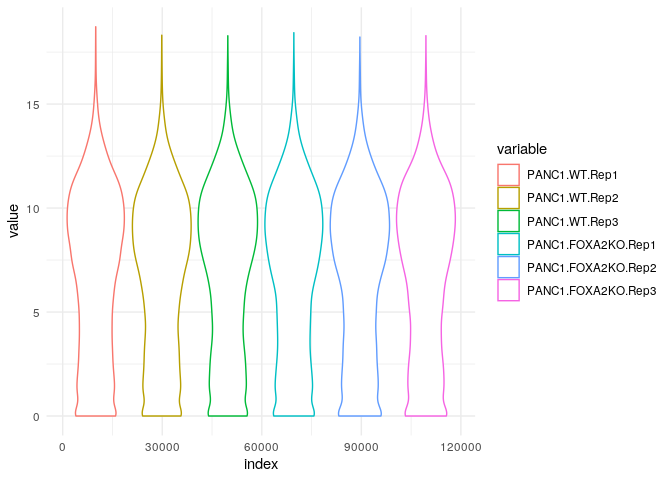
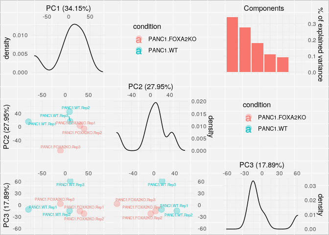
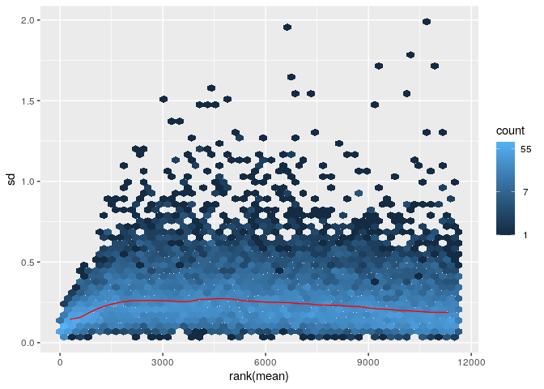
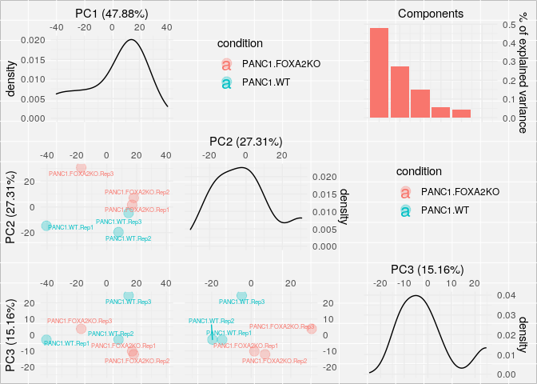

01\_normalisation
================
Aurelien Dugourd
5/11/2020

### License Info

This program is free software: you can redistribute it and/or modify it
under the terms of the GNU General Public License as published by the
Free Software Foundation, either version 3 of the License, or (at your
option) any later version.

This program is distributed in the hope that it will be useful, but
WITHOUT ANY WARRANTY; without even the implied warranty of
MERCHANTABILITY or FITNESS FOR A PARTICULAR PURPOSE. See the GNU General
Public License for more details.

Please check
<a href="http://www.gnu.org/licenses/" class="uri">http://www.gnu.org/licenses/</a>.

Introduction
------------

Here we present examples of normalisation strategies of omic dataset,
using RNAseq for the present case.

Getting Started
---------------

We first load the required libraries.

    #Main libraries
    library(readr)
    library(vsn)

    #Support functions also requires
    library(ggplot2)
    library(reshape)
    library(pheatmap)
    library(gridExtra)
    library(grid)
    library(cowplot)
    library(ggrepel)
    library(hexbin)

    source("support_functions.R")

### Import the raw count dataframe

downloaded from
<a href="https://www.ncbi.nlm.nih.gov/geo/query/acc.cgi?acc=GSE119931" class="uri">https://www.ncbi.nlm.nih.gov/geo/query/acc.cgi?acc=GSE119931</a>
download the file : GSE119931\_PANC1.FOXA2KO.genes.counts.txt.gz and
decompress it in the data folder

    ## Raw counts table
    GSE119931_PANC1_FOXA2KO_genes_counts <- as.data.frame(
      read_delim("../data/GSE119931_PANC1.FOXA2KO.genes.counts.txt", 
                 "\t", escape_double = FALSE, trim_ws = TRUE)) 

    ## Parsed with column specification:
    ## cols(
    ##   Geneid = col_character(),
    ##   Chr = col_character(),
    ##   Start = col_character(),
    ##   End = col_character(),
    ##   Strand = col_character(),
    ##   Length = col_double(),
    ##   PANC1.WT.Rep1 = col_double(),
    ##   PANC1.WT.Rep2 = col_double(),
    ##   PANC1.WT.Rep3 = col_double(),
    ##   PANC1.FOXA2KO.Rep1 = col_double(),
    ##   PANC1.FOXA2KO.Rep2 = col_double(),
    ##   PANC1.FOXA2KO.Rep3 = col_double()
    ## )

    count_df <- GSE119931_PANC1_FOXA2KO_genes_counts[,c(7:12)]
    row.names(count_df) <- GSE119931_PANC1_FOXA2KO_genes_counts$Geneid

### Pre-processing and normalisation

First create a dataframe to summarise experimental design called targets

    targets <- as.data.frame(matrix(NA,length(names(count_df)),2))
    names(targets) <- c("sample","condition")
    targets$sample <- names(count_df)
    targets$condition <- gsub(".Rep[0-9]$","",targets$sample)

Make some plots to check what the data looks like after only a log2
transformation

    #First we remove rows that contain only 0
    count_df <- count_df[rowSums(count_df) > 0,]
    #remaining 0 have to be made as NA so that log2 transformation is possible
    count_df[count_df == 0] <- NA

    #make the plots
    plots <- magicPlotMakerLight(df = log2(count_df), targets = targets)

    ## Using ID as id variables

    ## Warning: Using alpha for a discrete variable is not advised.

    ## Warning: Using alpha for a discrete variable is not advised.

    ## Warning: Using alpha for a discrete variable is not advised.

    ## Warning: Using alpha for a discrete variable is not advised.

    plot(plots[[1]]) #violins

    ## Warning: Removed 18617 rows containing non-finite values (stat_ydensity).

<!-- -->

    plot(plots[[2]]) #PCA

<!-- -->

From the violin plot, we can see that the distributions are bimodal.
Usually this is because a lots of genes are expressed under the RNAseq
detection threshold and will give rise to a noisy sub-distribution. We
want to get rid of those reads, so based on the violin plot, we decide
to exclude any transcript with less that 4 log2(counts).

Usually, A cleaned up dataframe wil have roughly between 9000 and 15000
measured genes.

    count_df[log2(count_df) < 4 ] <- NA

    #remove rows that don't have enough well measured genes in enough samples
    count_df <- count_df[rowSums(is.na(count_df[,c(1:3)])) < 2,]
    count_df <- count_df[rowSums(is.na(count_df[,c(4:6)])) < 2,]

### VSN normalisation

    #now we can normalise the cleaned dataframe using vsn
    fit <- vsnMatrix(as.matrix(count_df)) #train vsn parameters

    ## vsn2: 11632 x 6 matrix (1 stratum).

    ## Please use 'meanSdPlot' to verify the fit.

    #make sure the mean/sd trend is not going crazy
    meanSdPlot(fit)

<!-- -->

    #if good, normalise data with the trained parameters of vsn
    count_df_vsn <- as.data.frame(vsn::predict(fit,as.matrix(count_df)))

We want to avoid finding big fragmentated clusters of points in the
means/sd plot. Here it looks pretty good so we can move forward.

    #now let's visualise the normalised data
    plots <- magicPlotMakerLight(df = count_df_vsn, targets = targets) 

    ## Using ID as id variables

    ## Warning: Using alpha for a discrete variable is not advised.

    ## Warning: Removed 1 rows containing missing values (geom_text).

    ## Warning: Using alpha for a discrete variable is not advised.

    ## Warning: Using alpha for a discrete variable is not advised.

    ## Warning: Using alpha for a discrete variable is not advised.

    plot(plots[[1]]) #violins

    ## Warning: Removed 712 rows containing non-finite values (stat_ydensity).

<!-- -->

    plot(plots[[2]]) #PCA

<!-- -->

from PCA, we see that conditions are well seprated by 2nd component. So
it’s ok, we will have some signal.

### Identifier kung-fu (optional)

since here with have ensembl id but most our ressources are based on
either uniprot or gene symbole

we need to do some identifer kung-fu

    #since here with have ensembl id but most our ressources are based on either uniprot or gene symbole
    #we need to do some identifer kung-fu

    #I got this identifer matching dataframe from uniprot
    gene_id_mapping_from_uniprot <- as.data.frame(
      read_delim("../support/gene_id_mapping_from_uniprot.tab", 
                 "\t", escape_double = FALSE, trim_ws = TRUE))

    ## Parsed with column specification:
    ## cols(
    ##   `yourlist:M201912038471C63D39733769F8E060B506551E125F0C55R` = col_character(),
    ##   `isomap:M201912038471C63D39733769F8E060B506551E125F0C55R` = col_character(),
    ##   Entry = col_character(),
    ##   `Entry name` = col_character(),
    ##   Status = col_character(),
    ##   `Protein names` = col_character(),
    ##   `Gene names` = col_character(),
    ##   Organism = col_character(),
    ##   Length = col_double()
    ## )

    gene_id_mapping_from_uniprot <- gene_id_mapping_from_uniprot[!is.na(gene_id_mapping_from_uniprot$`Gene names`),]

    #let's make a pseudo dictionary to make the mapping efficient
    ensembl_to_symbol <- gsub(" .*","",gene_id_mapping_from_uniprot$`Gene names`)
    names(ensembl_to_symbol) <- gene_id_mapping_from_uniprot[,1]

    #remove all genes that have no gene symbol from our count dataframe
    row.names(count_df_vsn) <- gsub("[.][0-9]*","",row.names(count_df_vsn))
    count_df_vsn <- count_df_vsn[row.names(count_df_vsn) %in% names(ensembl_to_symbol),]

    #now let's convert ids with the pseudo dictionary
    for(i in 1:length(count_df_vsn[,1]))
    {
      row.names(count_df_vsn)[i] <- ensembl_to_symbol[row.names(count_df_vsn)[i]]
    }

Write count and target files for further analysis
-------------------------------------------------

    to_write <- count_df_vsn
    to_write$gene <- row.names(to_write)
    to_write <- to_write[,c(length(to_write[1,]),1:(length(to_write[1,])-1))]
    write_csv(to_write, "../data/count_df_vsn.csv")
    write_csv(targets, "../support/targets.csv")

Session Info Details
--------------------

    ## R version 4.0.2 (2020-06-22)
    ## Platform: x86_64-conda_cos6-linux-gnu (64-bit)
    ## Running under: Ubuntu 18.04.3 LTS
    ## 
    ## Matrix products: default
    ## BLAS/LAPACK: /home/jperales/dev/transcriptutorial/envs/transcriptutorial/lib/libopenblasp-r0.3.10.so
    ## 
    ## locale:
    ##  [1] LC_CTYPE=en_US.UTF-8       LC_NUMERIC=C              
    ##  [3] LC_TIME=en_GB.UTF-8        LC_COLLATE=en_US.UTF-8    
    ##  [5] LC_MONETARY=en_GB.UTF-8    LC_MESSAGES=en_US.UTF-8   
    ##  [7] LC_PAPER=en_GB.UTF-8       LC_NAME=C                 
    ##  [9] LC_ADDRESS=C               LC_TELEPHONE=C            
    ## [11] LC_MEASUREMENT=en_GB.UTF-8 LC_IDENTIFICATION=C       
    ## 
    ## attached base packages:
    ## [1] grid      parallel  stats     graphics  grDevices utils     datasets 
    ## [8] methods   base     
    ## 
    ## other attached packages:
    ##  [1] hexbin_1.28.1       ggrepel_0.8.2       cowplot_1.0.0      
    ##  [4] gridExtra_2.3       pheatmap_1.0.12     reshape_0.8.8      
    ##  [7] ggplot2_3.3.2       vsn_3.56.0          Biobase_2.48.0     
    ## [10] BiocGenerics_0.34.0 readr_1.3.1         rmarkdown_2.3      
    ## [13] nvimcom_0.9-82     
    ## 
    ## loaded via a namespace (and not attached):
    ##  [1] Rcpp_1.0.4.6          RColorBrewer_1.1-2    plyr_1.8.6           
    ##  [4] BiocManager_1.30.10   pillar_1.4.6          compiler_4.0.2       
    ##  [7] zlibbioc_1.34.0       tools_4.0.2           digest_0.6.25        
    ## [10] preprocessCore_1.50.0 evaluate_0.14         lifecycle_0.2.0      
    ## [13] tibble_3.0.3          gtable_0.3.0          lattice_0.20-41      
    ## [16] pkgconfig_2.0.3       rlang_0.4.7           yaml_2.2.1           
    ## [19] xfun_0.16             withr_2.2.0           stringr_1.4.0        
    ## [22] dplyr_1.0.1           knitr_1.29            generics_0.0.2       
    ## [25] vctrs_0.3.2           hms_0.5.3             tidyselect_1.1.0     
    ## [28] glue_1.4.1            R6_2.4.1              limma_3.44.1         
    ## [31] farver_2.0.3          purrr_0.3.4           magrittr_1.5         
    ## [34] scales_1.1.1          ellipsis_0.3.1        htmltools_0.5.0      
    ## [37] colorspace_1.4-1      labeling_0.3          stringi_1.4.6        
    ## [40] affy_1.66.0           munsell_0.5.0         crayon_1.3.4         
    ## [43] affyio_1.58.0
