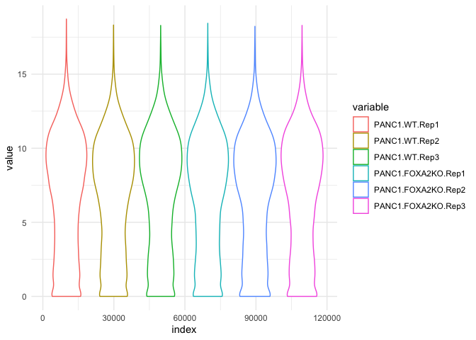
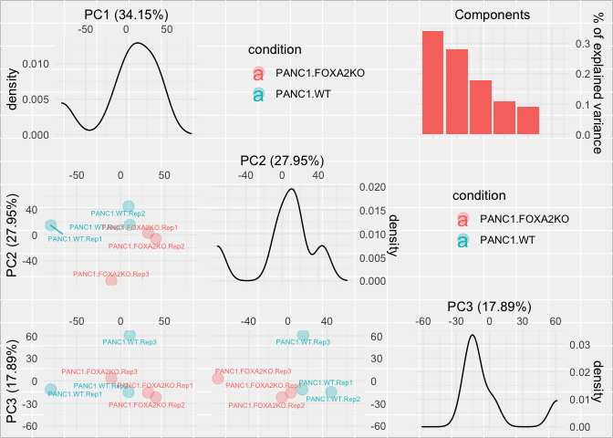
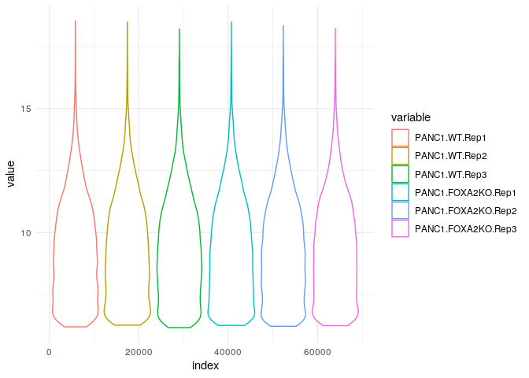
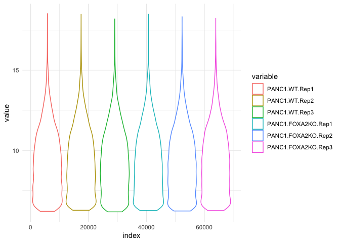
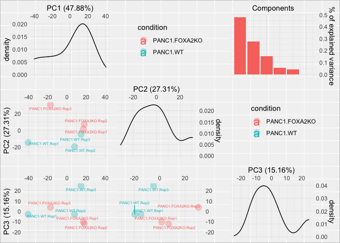

01\_normalisation
================
Aurelien Dugourd
5/11/2020

### License Info

This program is free software: you can redistribute it and/or modify it
under the terms of the GNU General Public License as published by the
Free Software Foundation, either version 3 of the License, or (at your
option) any later version.

This program is distributed in the hope that it will be useful, but
WITHOUT ANY WARRANTY; without even the implied warranty of
MERCHANTABILITY or FITNESS FOR A PARTICULAR PURPOSE. See the GNU General
Public License for more details.

Please check <http://www.gnu.org/licenses/>.

## Introduction

In the first part of our series of transcriptomics tutorials, we present
an example normalisation strategy for omic datasets, using RNAseq data
for the present case.

## Getting Started

We first load the required libraries.

``` r
#Main libraries
library(readr)
library(vsn)

#Support functions also requires
library(ggplot2)
library(reshape)
library(pheatmap)
library(gridExtra)
library(grid)
library(cowplot)
library(ggrepel)
library(hexbin)

source("support_functions.R")
```

### Import the raw count dataframe

The data can be downloaded from:
<https://www.ncbi.nlm.nih.gov/geo/query/acc.cgi?acc=GSE119931> Download
the file: GSE119931\_PANC1.FOXA2KO.genes.counts.txt.gz and decompress it
inside the ‘data’ folder.

``` r
## Raw counts table
GSE119931_PANC1_FOXA2KO_genes_counts <- as.data.frame(
  read_delim("../data/GSE119931_PANC1.FOXA2KO.genes.counts.txt", 
             "\t", escape_double = FALSE, trim_ws = TRUE)) 
```

    ## Parsed with column specification:
    ## cols(
    ##   Geneid = col_character(),
    ##   Chr = col_character(),
    ##   Start = col_character(),
    ##   End = col_character(),
    ##   Strand = col_character(),
    ##   Length = col_double(),
    ##   PANC1.WT.Rep1 = col_double(),
    ##   PANC1.WT.Rep2 = col_double(),
    ##   PANC1.WT.Rep3 = col_double(),
    ##   PANC1.FOXA2KO.Rep1 = col_double(),
    ##   PANC1.FOXA2KO.Rep2 = col_double(),
    ##   PANC1.FOXA2KO.Rep3 = col_double()
    ## )

The row names give the Ensembl IDs for the genes and the column names
give information about the condition and sample from which the data was
measured. For our analysis, we extract relevant columns from the raw
counts table.

``` r
count_df <- GSE119931_PANC1_FOXA2KO_genes_counts[,c(7:12)]
row.names(count_df) <- GSE119931_PANC1_FOXA2KO_genes_counts$Geneid
```

### Pre-processing and normalisation

First create a dataframe `targets` to summarise the experimental design.
We extract the condition information from the original column names.

``` r
targets <- as.data.frame(matrix(NA,length(names(count_df)),2))
names(targets) <- c("sample","condition")
targets$sample <- names(count_df)
targets$condition <- gsub(".Rep[0-9]$","",targets$sample)
```

We make some plots to check what the data looks like after just a log2
transformation (no normalisation)

``` r
#First we remove rows that contain only 0
count_df <- count_df[rowSums(count_df) > 0,]
#remaining 0 have to be made as NA so that log2 transformation is possible
count_df[count_df == 0] <- NA
```

``` r
#make the plots
plots <- magicPlotMakerLight(df = log2(count_df), targets = targets)
```

    ## Using ID as id variables

    ## Warning: Using alpha for a discrete variable is not advised.
    
    ## Warning: Using alpha for a discrete variable is not advised.
    
    ## Warning: Using alpha for a discrete variable is not advised.
    
    ## Warning: Using alpha for a discrete variable is not advised.

``` r
plot(plots[[1]]) #violins
```

    ## Warning: Removed 18617 rows containing non-finite values (stat_ydensity).

<!-- -->

``` r
plot(plots[[2]]) #PCA
```

<!-- -->

From the violin plot, we can see that the distributions are bimodal.
Usually this is because a lots of genes are expressed under the RNAseq
detection threshold and will give rise to a noisy sub-distribution. We
want to get rid of those reads, so based on the violin plot, we decide
to exclude any transcript with less that 4 log2(counts).

Usually, a cleaned-up dataframe will have roughly between 9000 and 15000
measured genes.

``` r
count_df[log2(count_df) < 4 ] <- NA

#remove rows (genes) which aren't well-measured in enough samples
count_df <- count_df[rowSums(is.na(count_df[,c(1:3)])) < 2,]
count_df <- count_df[rowSums(is.na(count_df[,c(4:6)])) < 2,]
```

### VSN normalisation

``` r
#now we can normalise the cleaned dataframe using vsn
fit <- vsnMatrix(as.matrix(count_df)) #train vsn parameters

#make sure the mean/sd trend is not going crazy
meanSdPlot(fit)
```

<!-- -->

``` r
#if good, normalise data with the trained parameters of vsn
count_df_vsn <- as.data.frame(vsn::predict(fit,as.matrix(count_df)))
```

We want to avoid finding big fragmented clusters of points in the
means/sd plot. Here it looks pretty good so we can move forward.

``` r
#now let's visualise the normalised data
plots <- magicPlotMakerLight(df = count_df_vsn, targets = targets) 
```

    ## Using ID as id variables

    ## Warning: Using alpha for a discrete variable is not advised.

    ## Warning: Removed 1 rows containing missing values (geom_text).

    ## Warning: Using alpha for a discrete variable is not advised.
    
    ## Warning: Using alpha for a discrete variable is not advised.
    
    ## Warning: Using alpha for a discrete variable is not advised.

``` r
plot(plots[[1]]) #violins
```

    ## Warning: Removed 712 rows containing non-finite values (stat_ydensity).

<!-- -->

``` r
plot(plots[[2]]) #PCA
```

<!-- -->

From PCA, we see that conditions are well separated by the 2nd
component. So it’s ok, we will have some signal.

### Identifier Kung-Fu (optional)

Since currently our dataset uses Ensembl IDs, but most of our resources
are based on UniProt or gene symbols, we need to do some identifier
Kung-Fu\!

``` r
# Gene ids and symbols retrieved from Biomart (Human genome 38):
gene_id_symbol <- 
    read.csv(file.path('..', 'support', 'gene_id_symbol.txt'), header = TRUE)
  rownames(gene_id_symbol) <- gene_id_symbol$id
  
# Remove all genes that have no gene id in the symbols df
count_df_vsn <- count_df_vsn[row.names(count_df_vsn) %in% 
                               rownames(gene_id_symbol),]
                               
# Remove all ids that are not in our count dataframe
gene_id_symbol <- gene_id_symbol[rownames(gene_id_symbol) %in% 
                                   row.names(count_df_vsn),]

# Get repeated symbols in symbols df
repeated_symbols <- gene_id_symbol %>% group_by(symbol) %>% 
  summarise(count=n()) %>% arrange(desc(count)) %>% filter(count > 1) %>% 
  select(symbol) %>% t() %>% unname() %>% c()
  
for(r in repeated_symbols){
  # Get repeated ids
  repeated_ids <- gene_id_symbol %>% 
    filter(symbol==r) %>% rownames()
  # Compute mean expression of genes
  mean_r <- count_df_vsn[repeated_ids,] %>% 
    summarise(across(everything(), list(mean)))
  # Update symbol with mean expression
  count_df_vsn[r,] <- mean_r
  # Remove id
  count_df_vsn <- count_df_vsn[!row.names(count_df_vsn) %in% repeated_ids,]
}

# Now let's convert ids with the pseudo dictionary
for(i in 1:length(count_df_vsn[,1]))
{
  # Only update the ids and skip the already present symbols
  if (!row.names(count_df_vsn)[i] %in% repeated_symbols){
    row.names(count_df_vsn)[i] <- 
      gene_id_symbol[row.names(count_df_vsn)[i],]$symbol
  }
}

```

## Write count and target files for further analysis

``` r
to_write <- count_df_vsn
to_write$gene <- row.names(to_write)
to_write <- to_write[,c(length(to_write[1,]),1:(length(to_write[1,])-1))]
write_csv(to_write, "../data/count_df_vsn.csv")
write_csv(targets, "../support/targets.csv")
```

## Session Info Details

    ## R version 4.0.2 (2020-06-22)
    ## Platform: x86_64-apple-darwin17.0 (64-bit)
    ## Running under: macOS Catalina 10.15.4
    ## 
    ## Matrix products: default
    ## BLAS:   /Library/Frameworks/R.framework/Versions/4.0/Resources/lib/libRblas.dylib
    ## LAPACK: /Library/Frameworks/R.framework/Versions/4.0/Resources/lib/libRlapack.dylib
    ## 
    ## locale:
    ## [1] en_US.UTF-8/en_US.UTF-8/en_US.UTF-8/C/en_US.UTF-8/en_US.UTF-8
    ## 
    ## attached base packages:
    ## [1] grid      parallel  stats     graphics  grDevices utils     datasets 
    ## [8] methods   base     
    ## 
    ## other attached packages:
    ##  [1] hexbin_1.28.1       ggrepel_0.8.2       cowplot_1.0.0      
    ##  [4] gridExtra_2.3       pheatmap_1.0.12     reshape_0.8.8      
    ##  [7] ggplot2_3.3.2       vsn_3.56.0          Biobase_2.48.0     
    ## [10] BiocGenerics_0.34.0 readr_1.3.1        
    ## 
    ## loaded via a namespace (and not attached):
    ##  [1] Rcpp_1.0.5            RColorBrewer_1.1-2    plyr_1.8.6           
    ##  [4] BiocManager_1.30.10   pillar_1.4.6          compiler_4.0.2       
    ##  [7] zlibbioc_1.34.0       tools_4.0.2           digest_0.6.25        
    ## [10] preprocessCore_1.50.0 evaluate_0.14         lifecycle_0.2.0      
    ## [13] tibble_3.0.3          gtable_0.3.0          lattice_0.20-41      
    ## [16] pkgconfig_2.0.3       rlang_0.4.7           yaml_2.2.1           
    ## [19] xfun_0.16             withr_2.2.0           stringr_1.4.0        
    ## [22] dplyr_1.0.2           knitr_1.29            generics_0.0.2       
    ## [25] vctrs_0.3.4           hms_0.5.3             tidyselect_1.1.0     
    ## [28] glue_1.4.2            R6_2.4.1              rmarkdown_2.3        
    ## [31] limma_3.44.3          farver_2.0.3          purrr_0.3.4          
    ## [34] magrittr_1.5          scales_1.1.1          ellipsis_0.3.1       
    ## [37] htmltools_0.5.0       colorspace_1.4-1      labeling_0.3         
    ## [40] stringi_1.4.6         affy_1.66.0           munsell_0.5.0        
    ## [43] crayon_1.3.4          affyio_1.58.0
