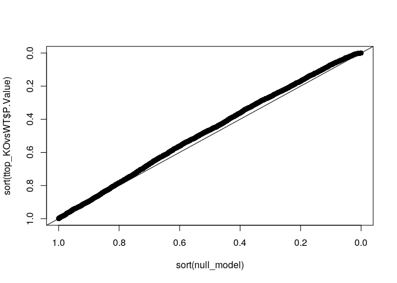

02\_Differential\_analysis
================
Aurelien Dugourd
5/12/2020

### License Info

This program is free software: you can redistribute it and/or modify it
under the terms of the GNU General Public License as published by the
Free Software Foundation, either version 3 of the License, or (at your
option) any later version.

This program is distributed in the hope that it will be useful, but
WITHOUT ANY WARRANTY; without even the implied warranty of
MERCHANTABILITY or FITNESS FOR A PARTICULAR PURPOSE. See the GNU General
Public License for more details.

Please check
<a href="http://www.gnu.org/licenses/" class="uri">http://www.gnu.org/licenses/</a>.

Introduction
------------

Here we present examples of differential analysis of omic dataset, using
RNAseq for the present case.

Getting Started
---------------

We first load the required libraries.

    #Main libraries
    library(readr)
    library(limma)

    #Support functions also requires
    library(ggplot2)
    library(reshape)
    library(pheatmap)
    library(gridExtra)
    library(grid)
    library(cowplot)
    library(ggrepel)
    library(hexbin)

    source("support_functions.R")

### Import the normalised dataframe and experiemental design

    #Data
    count_df_vsn <- as.data.frame(read_csv("../data/count_df_vsn.csv"))

    ## Parsed with column specification:
    ## cols(
    ##   gene = col_character(),
    ##   PANC1.WT.Rep1 = col_double(),
    ##   PANC1.WT.Rep2 = col_double(),
    ##   PANC1.WT.Rep3 = col_double(),
    ##   PANC1.FOXA2KO.Rep1 = col_double(),
    ##   PANC1.FOXA2KO.Rep2 = col_double(),
    ##   PANC1.FOXA2KO.Rep3 = col_double()
    ## )

    row.names(count_df_vsn) <- count_df_vsn[,1]
    count_df_vsn <- count_df_vsn[,-1]
    #Design
    targets <- as.data.frame(read_csv("../support/targets.csv"))

    ## Parsed with column specification:
    ## cols(
    ##   sample = col_character(),
    ##   condition = col_character()
    ## )

### LIMMA differential analysis

now let’s run a simple differential analysis using a simple wrapper for
such situation

    #first check the conditions order
    unique(targets$condition)

    ## [1] "PANC1.WT"      "PANC1.FOXA2KO"

    #we want to compare the KO with the WT so we build a comparison list
    comparisons <- list("KOvsWT" = c(2,-1)) #each vector of the list represent the contrasts, here we substract the first condition (-1) to the second one (2)

    #now that the comparisons are defined, we can run limma
    limmaRes <- runLimma(measurements = count_df_vsn, 
                         targets = targets, 
                         comparisons = comparisons)

    ##               V1
    ## PANC1.WT      -1
    ## PANC1.FOXA2KO  1

    #once limma has run, we extract the statistic dataframe summarise the differential analysis
    ttop_KOvsWT <- ttopFormatter(topTable(limmaRes[[1]], coef = 1, number = length(count_df_vsn[,1]), adjust.method = "fdr"))

    ##make a qqplot
    null_model <- pnorm(rnorm(length(ttop_KOvsWT[,1])))
    plot(sort(null_model), sort(ttop_KOvsWT$P.Value) ,xlim = c(1,0), ylim = c(1,0)) #not bad, not great, let's proceed
    abline(coef = c(0,1))

<!-- -->

The qqplot (observed p-value distriubtion plotted against a random
baseline) is meant to give usan idea of the signal strength when
comparing KO and WT. The more the black dot line deviates from the
diagonal toward the upper part of the plot, the stronger the signal is.
This plot is very similar to a p-value histogram.

In this case, we can oberse a decent signal, but there are many context
where it could be much stronger. This type of difference is typical for
single mutations comapred to a wild type, which usually lead to weak
overall differences. Stronger differences are usually expected for
treatment vs control experiments, or when comparing tumor vs healthy
tissues.

### Write the DA output

    write_csv(ttop_KOvsWT, "../results/ttop_KOvsWT.csv")

Session Info Details
--------------------

    ## R version 4.0.2 (2020-06-22)
    ## Platform: x86_64-conda_cos6-linux-gnu (64-bit)
    ## Running under: Ubuntu 18.04.3 LTS
    ## 
    ## Matrix products: default
    ## BLAS/LAPACK: /home/jperales/dev/transcriptutorial/envs/transcriptutorial/lib/libopenblasp-r0.3.10.so
    ## 
    ## locale:
    ##  [1] LC_CTYPE=en_US.UTF-8       LC_NUMERIC=C              
    ##  [3] LC_TIME=en_GB.UTF-8        LC_COLLATE=en_US.UTF-8    
    ##  [5] LC_MONETARY=en_GB.UTF-8    LC_MESSAGES=en_US.UTF-8   
    ##  [7] LC_PAPER=en_GB.UTF-8       LC_NAME=C                 
    ##  [9] LC_ADDRESS=C               LC_TELEPHONE=C            
    ## [11] LC_MEASUREMENT=en_GB.UTF-8 LC_IDENTIFICATION=C       
    ## 
    ## attached base packages:
    ## [1] grid      stats     graphics  grDevices utils     datasets  methods  
    ## [8] base     
    ## 
    ## other attached packages:
    ##  [1] rmarkdown_2.3   hexbin_1.28.1   ggrepel_0.8.2   cowplot_1.0.0  
    ##  [5] gridExtra_2.3   pheatmap_1.0.12 reshape_0.8.8   ggplot2_3.3.2  
    ##  [9] limma_3.44.1    readr_1.3.1     nvimcom_0.9-82 
    ## 
    ## loaded via a namespace (and not attached):
    ##  [1] Rcpp_1.0.4.6       pillar_1.4.6       compiler_4.0.2     RColorBrewer_1.1-2
    ##  [5] plyr_1.8.6         tools_4.0.2        digest_0.6.25      evaluate_0.14     
    ##  [9] lifecycle_0.2.0    tibble_3.0.3       gtable_0.3.0       lattice_0.20-41   
    ## [13] pkgconfig_2.0.3    rlang_0.4.7        yaml_2.2.1         xfun_0.16         
    ## [17] stringr_1.4.0      knitr_1.29         withr_2.2.0        dplyr_1.0.1       
    ## [21] generics_0.0.2     vctrs_0.3.2        hms_0.5.3          tidyselect_1.1.0  
    ## [25] glue_1.4.1         R6_2.4.1           purrr_0.3.4        magrittr_1.5      
    ## [29] scales_1.1.1       ellipsis_0.3.1     htmltools_0.5.0    colorspace_1.4-1  
    ## [33] stringi_1.4.6      munsell_0.5.0      crayon_1.3.4
