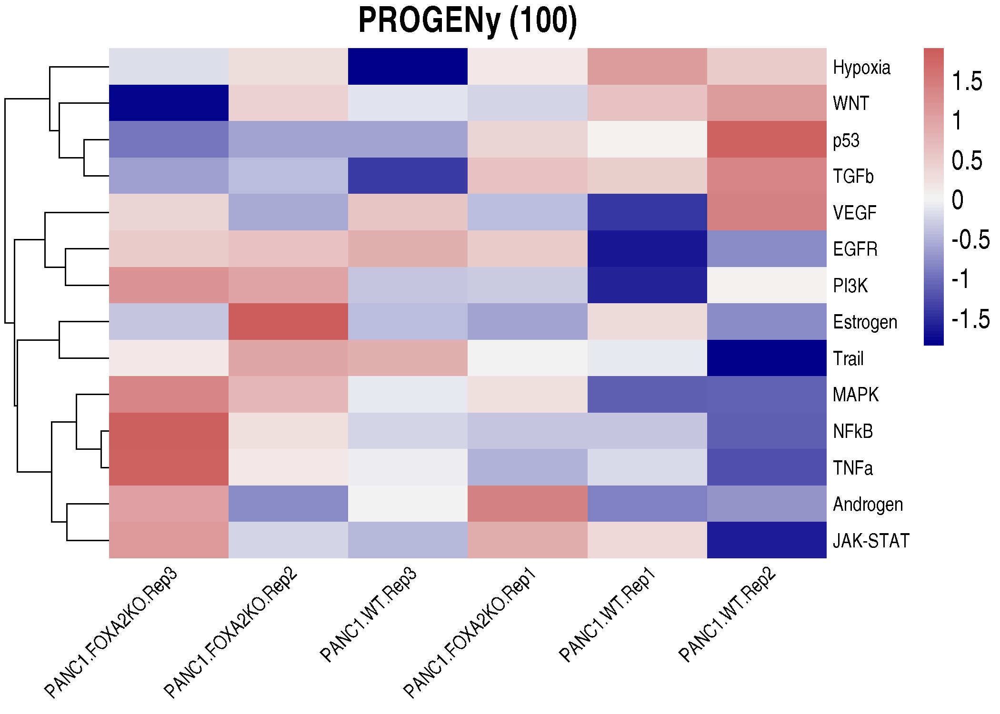
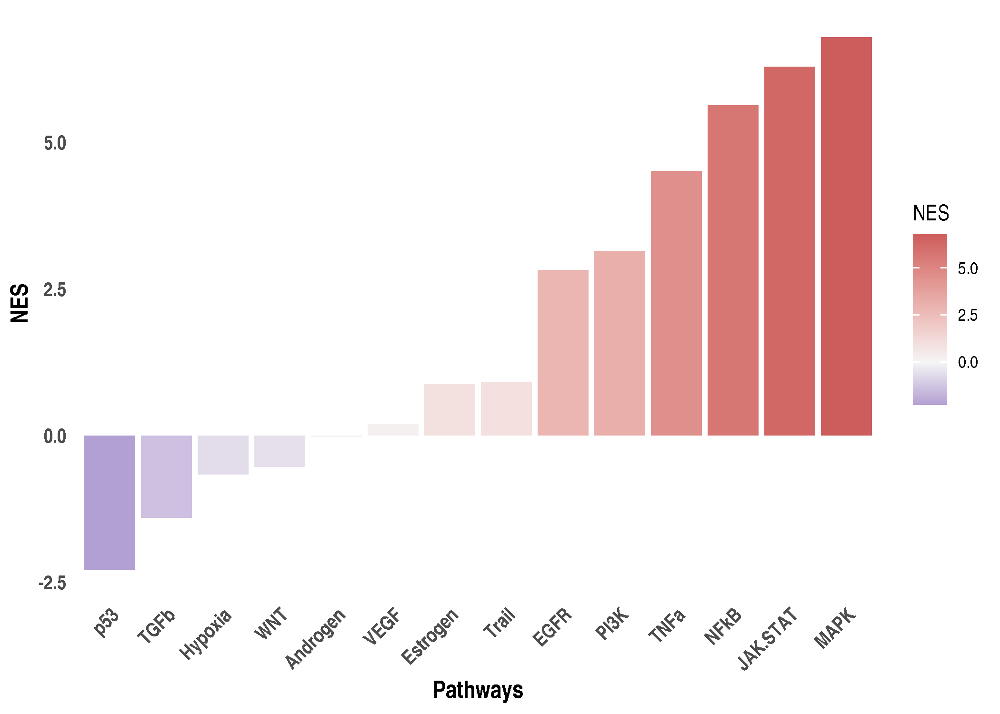
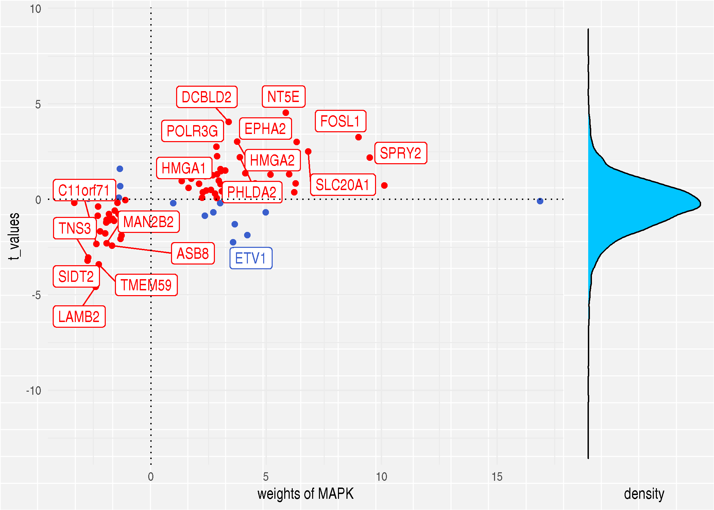

03\_Pathway\_activity\_with\_Progeny
================
Alberto Valdeolivas
13/05/2020

### License Info

This program is free software: you can redistribute it and/or modify it
under the terms of the GNU General Public License as published by the
Free Software Foundation, either version 3 of the License, or (at your
option) any later version.

This program is distributed in the hope that it will be useful, but
WITHOUT ANY WARRANTY; without even the implied warranty of
MERCHANTABILITY or FITNESS FOR A PARTICULAR PURPOSE. See the GNU General
Public License for more details.

Please check <http://www.gnu.org/licenses/>.

## Introduction

This is the third part in a series of transcriptomics tutorials. We
present here how to estimate pathway activity from transcriptomics data
using **PROGENy**.

Conventional pathway analysis methods rely on the gene expression of the
pathway members. However, this approach overlooks the effect of
post-translational modifications and only captures very specific
experimental conditions. To overcome these limitations, **PROGENy**
(Pathway RespOnsive GENes) estimates the activity of relevant signaling
pathways based on consensus gene signatures obtained from perturbation
experiments [(Schubert et
al. 2018)](https://www.nature.com/articles/s41467-017-02391-6)

**PROGENy** initially contained 11 pathways and was developed for the
application to human transcriptomics data. It has been recently shown
that **PROGENy** is also applicable to mouse data and it has been
expanded to 14 pathways [(Holland et
al., 2019)](https://doi.org/10.1016/j.bbagrm.2019.194431). In addition,
**PROGENy** can be applied to scRNA-seq data, as described in [(Holland
et al., 2020)](https://doi.org/10.1186/s13059-020-1949-z)

**PROGENy** is available as a [Bioconductor
package](http://bioconductor.org/packages/release/bioc/html/progeny.html).
For additional information about the **PROGENy** method, visit its
website:

<https://saezlab.github.io/progeny/>

## Getting Started

We first load the required libraries.

``` r
library(progeny)
library(dorothea)
library(tibble)
library(tidyr)
library(dplyr)
library(ggplot2)
library(pheatmap)
library(readr)
```

In addition, we read the results from the previous scripts:

  - Normalised transcriptomics data from (01\_normalisation.Rmd)
  - Differential expression analysis results
    (02\_differential\_analysis.Rmd). In this particular case, a top
    table results object from limma.

<!-- end list -->

``` r
## We read the normalised counts and the experimental design 
Normalised_counts <- read_csv("../data/count_df_vsn.csv")
Experimental_design <- read_csv("../support/targets.csv")

## We read the results from the differential analysis. 
ttop_KOvsWT <- read_csv("../results/ttop_KOvsWT.csv")
```

We have to slightly modify the format of the input files to make it
suitable for running Progeny.

``` r
Normalised_counts_matrix <- Normalised_counts %>% 
    dplyr::mutate_if(~ any(is.na(.x)),~ if_else(is.na(.x),0,.x)) %>% 
    tibble::column_to_rownames(var = "gene") %>% 
    as.matrix()

ttop_KOvsWT_matrix <- ttop_KOvsWT %>% 
    dplyr::select(ID, t) %>% 
    dplyr::filter(!is.na(t)) %>% 
    column_to_rownames(var = "ID") %>%
    as.matrix()
```

## Pathway activity with Progeny

We first compute **Progeny** scores for every sample (with the
replicates) using the normalised counts. It is worth noting that we are
going to use the 100 most responsive genes per pathway. This number can
be increased depending on the coverage of your experiments. For
instance, the number of quantified genes for single-cell RNA-seq is
smaller than for Bulk RNA-seq or microarray. In those cases, we suggest
to increase the number of responsive genes to 200-500.

``` r
PathwayActivity_counts <- progeny(Normalised_counts_matrix, scale=TRUE, 
    organism="Human", top = 100)
Activity_counts <- as.vector(PathwayActivity_counts)
```

We present the results in a heatmap:

``` r
paletteLength <- 100
myColor <- 
    colorRampPalette(c("darkblue", "whitesmoke","indianred"))(paletteLength)

progenyBreaks <- c(seq(min(Activity_counts), 0, 
    length.out=ceiling(paletteLength/2) + 1),
    seq(max(Activity_counts)/paletteLength, 
    max(Activity_counts), 
    length.out=floor(paletteLength/2)))

progeny_hmap <- pheatmap(t(PathwayActivity_counts),fontsize=14, 
    fontsize_row = 10, fontsize_col = 10, 
    color=myColor, breaks = progenyBreaks, 
    main = "PROGENy (100)", angle_col = 45,
    treeheight_col = 0,  border_color = NA)
```

<!-- -->

Now, we run an enrichment analysis using a competitive permutation
approach to assess the significance of the pathway activity. We end up
with Normalised Enrichment Scores (NES) for each pathway.

``` r
PathwayActivity_zscore <- progeny(ttop_KOvsWT_matrix, 
    scale=TRUE, organism="Human", top = 100, perm = 10000, z_scores = TRUE) %>%
    t()
colnames(PathwayActivity_zscore) <- "NES"
```

``` r
PathwayActivity_zscore_df <- as.data.frame(PathwayActivity_zscore) %>% 
    rownames_to_column(var = "Pathway") %>%
    dplyr::arrange(NES) %>%
    dplyr::mutate(Pathway = factor(Pathway))

ggplot(PathwayActivity_zscore_df,aes(x = reorder(Pathway, NES), y = NES)) + 
    geom_bar(aes(fill = NES), stat = "identity") +
    scale_fill_gradient2(low = "darkblue", high = "indianred", 
        mid = "whitesmoke", midpoint = 0) + 
    theme_minimal() +
    theme(axis.title = element_text(face = "bold", size = 12),
        axis.text.x = 
            element_text(angle = 45, hjust = 1, size =10, face= "bold"),
        axis.text.y = element_text(size =10, face= "bold"),
        panel.grid.major = element_blank(), 
        panel.grid.minor = element_blank()) +
    xlab("Pathways")
```

<!-- -->

The MAPK pathway is the most active pathway upon the perturbation that
we are studying (KO of the FOXA2 gene versus the wild-type). We can
therefore visualise the MAPK most responsive genes (progeny weights)
along with their t\_values to interpret the results. In the scatterplot,
we can see the genes that are contributing the most to the pathway
enrichment.

``` r
prog_matrix <- getModel("Human", top=100) %>% 
    as.data.frame()  %>%
    tibble::rownames_to_column("GeneID")

ttop_KOvsWT_df <- ttop_KOvsWT_matrix %>% 
    as.data.frame() %>% 
    tibble::rownames_to_column("GeneID")

scat_plots <- progeny::progenyScatter(df = ttop_KOvsWT_df, 
    weight_matrix = prog_matrix, 
    statName = "t_values", verbose = FALSE)
```

``` r
plot(scat_plots[[1]]$`MAPK`) 
```

<!-- -->

Progeny results can be used as an optional input for **CARNIVAL**.
CARNIVAL sets weights based on **PROGENy** scores in each
pathway-related node in order to find more relevant solutions. We
therefore run **PROGENy** again with slightly different parameters,
setting `z_scores = FALSE` so that **PROGENy** returns pathway activity
values between 1 and -1, rather than converting to Z-Scores.

``` r
PathwayActivity_CARNIVALinput <- progeny(ttop_KOvsWT_matrix, 
    scale=TRUE, organism="Human", top = 100, perm = 10000, z_scores = FALSE) %>%
    t () %>% 
    as.data.frame() %>% 
    tibble::rownames_to_column(var = "Pathway") 
colnames(PathwayActivity_CARNIVALinput)[2] <- "score"
write_csv(PathwayActivity_CARNIVALinput, 
    "../results/PathwayActivity_CARNIVALinput.csv")
```

## References

> Schubert M, Klinger B, Klünemann M, Sieber A, Uhlitz F, Sauer S,
> Garnett MJ, Blüthgen N, Saez-Rodriguez J. “Perturbation-response genes
> reveal signaling footprints in cancer gene expression.” *Nature
> Communications*:
> [10.1038/s41467-017-02391-6](https://doi.org/10.1038/s41467-017-02391-6)

> Holland CH, Szalai B, Saez-Rodriguez J. “Transfer of regulatory
> knowledge from human to mouse for functional genomics analysis.”
> *Biochimica et Biophysica Acta (BBA) - Gene Regulatory Mechanisms.*
> 2019. DOI:
> [10.1016/j.bbagrm.2019.194431](https://doi.org/10.1016/j.bbagrm.2019.194431).

> Holland CH, Tanevski J, Perales-Patón J, Gleixner J, Kumar MP, Mereu
> E, Joughin BA, Stegle O, Lauffenburger DA, Heyn H, Szalai B,
> Saez-Rodriguez, J. “Robustness and applicability of transcription
> factor and pathway analysis tools on single-cell RNA-seq data.”
> *Genome Biology.* 2020. DOI:
> [10.1186/s13059-020-1949-z](https://doi.org/10.1186/s13059-020-1949-z).

## Session Info Details

    ## R version 4.0.2 (2020-06-22)
    ## Platform: x86_64-apple-darwin17.0 (64-bit)
    ## Running under: macOS Catalina 10.15.4
    ## 
    ## Matrix products: default
    ## BLAS:   /Library/Frameworks/R.framework/Versions/4.0/Resources/lib/libRblas.dylib
    ## LAPACK: /Library/Frameworks/R.framework/Versions/4.0/Resources/lib/libRlapack.dylib
    ## 
    ## locale:
    ## [1] en_US.UTF-8/en_US.UTF-8/en_US.UTF-8/C/en_US.UTF-8/en_US.UTF-8
    ## 
    ## attached base packages:
    ## [1] stats     graphics  grDevices utils     datasets  methods   base     
    ## 
    ## other attached packages:
    ## [1] readr_1.3.1     pheatmap_1.0.12 ggplot2_3.3.2   dplyr_1.0.2    
    ## [5] tidyr_1.1.2     tibble_3.0.3    dorothea_1.0.1  progeny_1.10.0 
    ## 
    ## loaded via a namespace (and not attached):
    ##  [1] Rcpp_1.0.5         RColorBrewer_1.1-2 pillar_1.4.6       compiler_4.0.2    
    ##  [5] tools_4.0.2        digest_0.6.25      evaluate_0.14      lifecycle_0.2.0   
    ##  [9] gtable_0.3.0       pkgconfig_2.0.3    rlang_0.4.7        ggrepel_0.8.2     
    ## [13] yaml_2.2.1         xfun_0.16          gridExtra_2.3      withr_2.2.0       
    ## [17] stringr_1.4.0      knitr_1.29         hms_0.5.3          generics_0.0.2    
    ## [21] vctrs_0.3.4        grid_4.0.2         tidyselect_1.1.0   glue_1.4.2        
    ## [25] R6_2.4.1           rmarkdown_2.3      farver_2.0.3       purrr_0.3.4       
    ## [29] bcellViper_1.24.0  magrittr_1.5       scales_1.1.1       ellipsis_0.3.1    
    ## [33] htmltools_0.5.0    colorspace_1.4-1   labeling_0.3       stringi_1.4.6     
    ## [37] munsell_0.5.0      crayon_1.3.4
