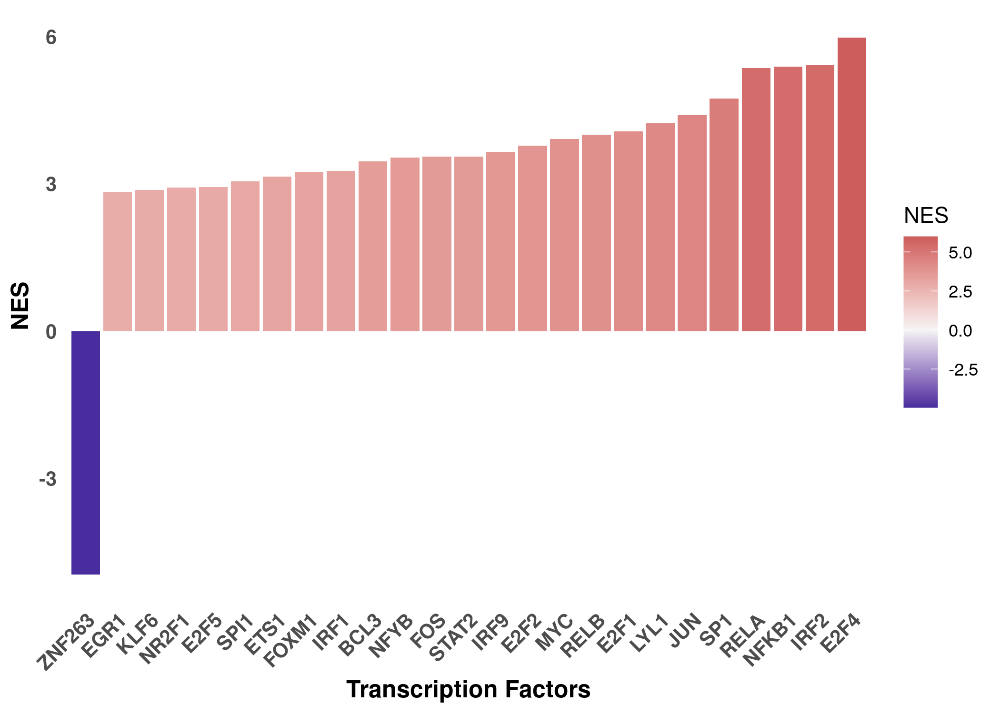
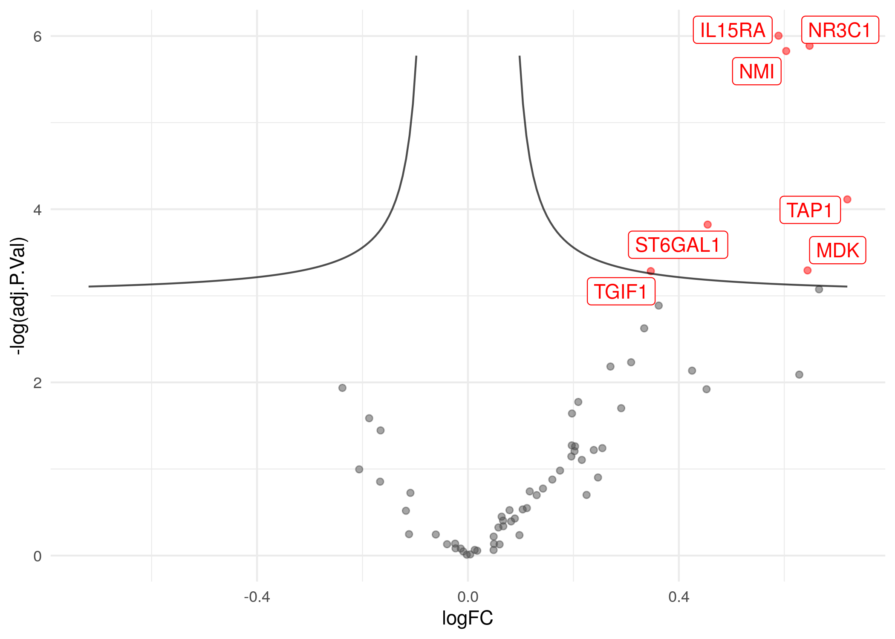
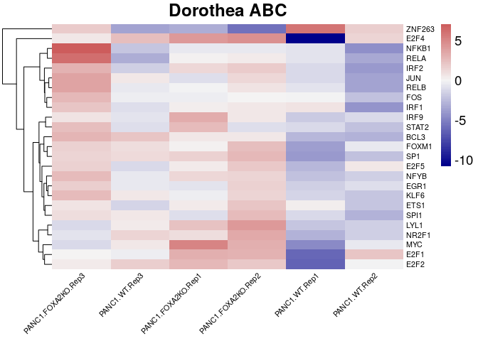

04\_TranscriptionFactor\_activity\_with\_Dorothea
================
Alberto Valdeolivas
13/05/2020

### License Info

This program is free software: you can redistribute it and/or modify it
under the terms of the GNU General Public License as published by the
Free Software Foundation, either version 3 of the License, or (at your
option) any later version.

This program is distributed in the hope that it will be useful, but
WITHOUT ANY WARRANTY; without even the implied warranty of
MERCHANTABILITY or FITNESS FOR A PARTICULAR PURPOSE. See the GNU General
Public License for more details.

Please check <http://www.gnu.org/licenses/>.

## Introduction

This is the fourth tutorial in a series of transcriptomics tutorials.
Here, we present how to estimate transcription factor (TF) activity from
transcriptomics data using **DoRothEA**.

**DoRothEA** is a comprehensive resource containing a curated collection
of TFs and their transcriptional targets. The set of genes regulated by
a specific TF is known as regulon. **DoRothEA’s** regulons were gathered
from different types of evidence. Each TF-target interaction is defined
by a confidence level based on the volume of supporting evidence. The
confidence levels range from A (highest confidence) to E (lowest
confidence) [(Garcia-Alonso et
al. 2019)](https://doi.org/10.1101/gr.240663.118)

**DoRothEA** regulons are usually coupled with the statistical method
**VIPER** [(Alvarez et al. 2016)](https://doi.org/10.1038/ng.3593). In
this context, TF activities are computed based on the mRNA expression
levels of its targets. We therefore can consider TF activity as a proxy
of a given transcriptional state.

Originally **DoRothEA** contained only human regulons. In a benchmark
study, we showed that **DoRothEA** in combination with **VIPER** is also
applicable to mouse data. Accordingly, we developed a mouse version of
DoRothEA by transforming the human genes to their mouse orthologs
[(Holland et al., 2019)](https://doi.org/10.1016/j.bbagrm.2019.194431).
In addition, **DoRothEA** can be applied to scRNA-seq data, as described
in [(Holland et al., 2020)](https://doi.org/10.1186/s13059-020-1949-z)

**DoRothEA** is available as a [Bioconductor
package](http://bioconductor.org/packages/release/data/experiment/html/dorothea.html).
For additional information about the **DoRothEA** method, visit its
website:

<https://saezlab.github.io/dorothea/>

## Getting Started

We first load the required libraries and the support functions.

``` r
library(progeny)
library(dorothea)
library(tibble)
library(tidyr)
library(dplyr)
library(ggplot2)
library(pheatmap)
library(readr)

## For the volcano plot (related to support functions)
library(ggrepel)

## We also load the support functions
source("support_functions.R")
```

In addition, we read the results from the previous scripts:

  - Normalised transcriptomics data from (01\_normalisation.Rmd)
  - Differential expression analysis results
    (02\_differential\_analysis.Rmd). In this particular case, a top
    table results object from limma.

<!-- end list -->

``` r
## We read the normalised counts and the experimental design 
Normalised_counts <- read_csv("../data/count_df_vsn.csv")
Experimental_design <- read_csv("../support/targets.csv")

## We read the results from the differential analysis. 
ttop_KOvsWT <- read_csv("../results/ttop_KOvsWT.csv")
```

We have to slightly modify the format of the input files to make them
suitable for running **DoRothEA**.

``` r
Normalised_counts_matrix <- Normalised_counts %>% 
    dplyr::mutate_if(~ any(is.na(.x)),~ if_else(is.na(.x),0,.x)) %>% 
    tibble::column_to_rownames(var = "gene") %>% 
    as.matrix()

ttop_KOvsWT_matrix <- ttop_KOvsWT %>% 
    dplyr::select(ID, t) %>% 
    dplyr::filter(!is.na(t)) %>% 
    column_to_rownames(var = "ID") %>%
    as.matrix()
```

## Transcription Factor activity with DoRothEA

We estimate the transcription factor (TF) activity using the
**DoRothEA** R package. We select interactions with confidence level A,
B and C.

``` r
## We load Dorothea Regulons
data(dorothea_hs, package = "dorothea")
regulons <- dorothea_hs %>%
  dplyr::filter(confidence %in% c("A", "B","C"))
```

Note that for **DoRothEA**, we proceed the other way around than for
**PROGENy**. We have many TFs, so we cannot clearly visualize all of
them in the same heatmap. That is why we first compute a TF activity
enrichment analysis using the statistics from the differential
expression analysis. This will allow us to select the TFs whose activity
varies with the conditions under study.

It is important to set the parameter `eset.filter` to `FALSE`. In this
case, we set the minimum size of regulons to five (`minsize`). I
strongly recommend to check `?viper` to set the parameters that best fit
your needs.

``` r
tf_activities_stat <- dorothea::run_viper(ttop_KOvsWT_matrix, regulons,
    options =  list(minsize = 5, eset.filter = FALSE, 
    cores = 1, verbose = FALSE, nes = TRUE))
```

We now display the top 25 normalized enrichment scores (NES) for the TFs
in a bar plot.

``` r
tf_activities_stat_top25 <- tf_activities_stat %>%
    as.data.frame() %>% 
    rownames_to_column(var = "GeneID") %>%
    dplyr::rename(NES = "t") %>%
    dplyr::top_n(25, wt = abs(NES)) %>%
    dplyr::arrange(NES) %>% 
    dplyr::mutate(GeneID = factor(GeneID))

ggplot(tf_activities_stat_top25,aes(x = reorder(GeneID, NES), y = NES)) + 
    geom_bar(aes(fill = NES), stat = "identity") +
    scale_fill_gradient2(low = "darkblue", high = "indianred", 
        mid = "whitesmoke", midpoint = 0) + 
    theme_minimal() +
    theme(axis.title = element_text(face = "bold", size = 12),
        axis.text.x = 
            element_text(angle = 45, hjust = 1, size =10, face= "bold"),
        axis.text.y = element_text(size =10, face= "bold"),
        panel.grid.major = element_blank(), 
        panel.grid.minor = element_blank()) +
    xlab("Transcription Factors")
```

<!-- -->

To interpret the results, we can look at the expression of targets of
one of the most deregulated TFs, such as IRF2

``` r
targets_IRF2 <- regulons$target[regulons$tf == "IRF2"]
volcano_nice(as.data.frame(ttop_KOvsWT[ttop_KOvsWT$ID %in% targets_IRF2,]), 
    FCIndex = 2, pValIndex = 5, IDIndex = 1,nlabels = 20, label = TRUE, 
    straight = FALSE) 
```

<!-- -->

The TF activity enrichment results provided by **Viper** are used as an
input in the **CARNIVAL** method. **CARNIVAL** tries to infer the most
likely upstream signaling events leading to the current TF activity
results.

``` r
tf_activities_CARNIVALinput<- tf_activities_stat %>%
    as.data.frame() %>% 
    tibble::rownames_to_column(var = "TF") 
write_csv(tf_activities_CARNIVALinput, "../results/TFActivity_CARNIVALinput.csv")
```

We now compute TF activities per sample (with the replicates) using the
normalised counts. We display the results of the previous 25 TFs in a
Heatmap.

``` r
tf_activities_counts <- 
    dorothea::run_viper(Normalised_counts_matrix, regulons,
    options =  list(minsize = 5, eset.filter = FALSE, 
    cores = 1, verbose = FALSE, method = c("scale")))

tf_activities_counts_filter <- tf_activities_counts %>% 
    as.data.frame() %>% 
    rownames_to_column(var = "GeneID") %>%
    dplyr::filter(GeneID %in% tf_activities_stat_top25$GeneID) %>%
    column_to_rownames(var = "GeneID") %>%
    as.matrix()
tf_activities_vector <- as.vector(tf_activities_counts_filter)
```

``` r
paletteLength <- 100
myColor <- 
    colorRampPalette(c("darkblue", "whitesmoke","indianred"))(paletteLength)

dorotheaBreaks <- c(seq(min(tf_activities_vector), 0, 
    length.out=ceiling(paletteLength/2) + 1),
    seq(max(tf_activities_vector)/paletteLength, 
    max(tf_activities_vector), 
    length.out=floor(paletteLength/2)))
dorothea_hmap <- pheatmap(tf_activities_counts_filter,
    fontsize=14, fontsize_row = 8, fontsize_col = 8, 
    color=myColor, breaks = dorotheaBreaks,
    main = "Dorothea ABC", angle_col = 45,
    treeheight_col = 0,  border_color = NA)
```

<!-- -->

## References

> Garcia-Alonso L, Holland CH, Ibrahim MM, Turei D, Saez-Rodriguez J.
> “Benchmark and integration of resources for the estimation of human
> transcription factor activities.” *Genome Research*. 2019. DOI:
> [10.1101/gr.240663.118](https://genome.cshlp.org/content/29/8/1363).

> Holland CH, Szalai B, Saez-Rodriguez J. “Transfer of regulatory
> knowledge from human to mouse for functional genomics analysis.”
> *Biochimica et Biophysica Acta (BBA) - Gene Regulatory Mechanisms.*
> 2019. DOI:
> [10.1016/j.bbagrm.2019.194431](https://doi.org/10.1016/j.bbagrm.2019.194431).

> Holland CH, Tanevski J, Perales-Patón J, Gleixner J, Kumar MP, Mereu
> E, Joughin BA, Stegle O, Lauffenburger DA, Heyn H, Szalai B,
> Saez-Rodriguez, J. “Robustness and applicability of transcription
> factor and pathway analysis tools on single-cell RNA-seq data.”
> *Genome Biology.* 2020. DOI:
> [10.1186/s13059-020-1949-z](https://doi.org/10.1186/s13059-020-1949-z).

## Session Info Details

    ## R version 4.0.2 (2020-06-22)
    ## Platform: x86_64-apple-darwin17.0 (64-bit)
    ## Running under: macOS Catalina 10.15.4
    ## 
    ## Matrix products: default
    ## BLAS:   /Library/Frameworks/R.framework/Versions/4.0/Resources/lib/libRblas.dylib
    ## LAPACK: /Library/Frameworks/R.framework/Versions/4.0/Resources/lib/libRlapack.dylib
    ## 
    ## locale:
    ## [1] en_US.UTF-8/en_US.UTF-8/en_US.UTF-8/C/en_US.UTF-8/en_US.UTF-8
    ## 
    ## attached base packages:
    ## [1] stats     graphics  grDevices utils     datasets  methods   base     
    ## 
    ## other attached packages:
    ## [1] ggrepel_0.8.2   readr_1.3.1     pheatmap_1.0.12 ggplot2_3.3.2  
    ## [5] dplyr_1.0.2     tidyr_1.1.2     tibble_3.0.3    dorothea_1.0.1 
    ## [9] progeny_1.10.0 
    ## 
    ## loaded via a namespace (and not attached):
    ##  [1] mixtools_1.2.0      bcellViper_1.24.0   tidyselect_1.1.0   
    ##  [4] xfun_0.16           kernlab_0.9-29      purrr_0.3.4        
    ##  [7] splines_4.0.2       lattice_0.20-41     colorspace_1.4-1   
    ## [10] vctrs_0.3.4         generics_0.0.2      htmltools_0.5.0    
    ## [13] yaml_2.2.1          survival_3.2-3      rlang_0.4.7        
    ## [16] e1071_1.7-3         pillar_1.4.6        glue_1.4.2         
    ## [19] withr_2.2.0         BiocGenerics_0.34.0 segmented_1.2-0    
    ## [22] RColorBrewer_1.1-2  lifecycle_0.2.0     stringr_1.4.0      
    ## [25] munsell_0.5.0       gtable_0.3.0        evaluate_0.14      
    ## [28] labeling_0.3        Biobase_2.48.0      knitr_1.29         
    ## [31] parallel_4.0.2      class_7.3-17        Rcpp_1.0.5         
    ## [34] KernSmooth_2.23-17  scales_1.1.1        farver_2.0.3       
    ## [37] viper_1.22.0        gridExtra_2.3       hms_0.5.3          
    ## [40] digest_0.6.25       stringi_1.4.6       grid_4.0.2         
    ## [43] tools_4.0.2         magrittr_1.5        crayon_1.3.4       
    ## [46] pkgconfig_2.0.3     ellipsis_0.3.1      MASS_7.3-52        
    ## [49] Matrix_1.2-18       rmarkdown_2.3       R6_2.4.1           
    ## [52] compiler_4.0.2
