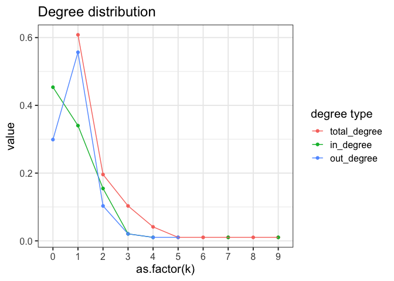

06\_analysis\_CARNIVAL\_results
================
Rosa Hernansaiz-Ballesteros
18/07/2020

### License Info

This program is free software: you can redistribute it and/or modify it
under the terms of the GNU General Public License as published by the
Free Software Foundation, either version 3 of the License, or (at your
option) any later version.

This program is distributed in the hope that it will be useful, but
WITHOUT ANY WARRANTY; without even the implied warranty of
MERCHANTABILITY or FITNESS FOR A PARTICULAR PURPOSE. See the GNU General
Public License for more details.

Please check <http://www.gnu.org/licenses/>.

## CARNIVAL output

CARNIVAL (CAusal Reasoning for Network identification using Integer
VALue programming) returns a list with 4 elements:

  - weightedSIF. Character matrix. Contains a summary of *sifAll*, where
    *Weight* indicates the number of networks that present that
    interaction.

  - nodesAttributes. Character matrix. Contains a summary of
    *attributesAll*, where all columns ending in *Act* indicate the
    number of networks that present that node in each of the states
    (Zero = doesn’t appear in the network, Up = upregulated, Down =
    downregulated, Avg = average regulation). The column *NodeType*
    indicates if the node is a TF’s (T) or a perturbed one (S).

  - sifAll. List of character matrices. All networks that have been
    calculated.

  - attributesAll. List of character matrices.

NOTE: This is valid for current CARNIVAL version (1.0.0)

## CARNIVAL interpretation

The summary files ( *sifAll* and *attributesAll* ) can be directly used
to identify causal interactions between the perturbed nodes and the
selected Transcription Factors. In addition to extract direct
information from the network, we can run different downstream analysis
based on the necesities of each project.

Here are described some of the downstream approaches that we have used:

  - Pathway enrichment analysis
  - Network comparisons

# Get ready

``` r
library(readr)
library(piano)
library(dplyr)
library(ggplot2)
library(tibble)
library(tidyr)
library(dplyr)
library(ggplot2)
library(plyr)
library(GSEABase)
library(network)
library(reshape2)

# set working directory
setwd("/Users/rosherbal/Projects/transcriptutorial/scripts")

## We also load the support functions
source("support_enrichment.r")
source("support_networks.r")

## and the data

#read CARNIVAL results
carnival_result = readRDS("../results/carnival_result.rds")
carnival_sample_resolution = readRDS("../results/carnival_sample_resolution.rds")
```

# Enrichment Analysis

We define two different gene sets in order tor conduct the enrichment.
The first set contains the nodes that appear in the CARNIVAL output, and
are therefore relevant in the context of our input transcriptomic data.
The second set contains all the genes in our prior knowledge network
which are used as the backgroud.

We also downloaded from MSigDB <https://www.gsea-msigdb.org/> the
following dataset: c2.cp.v7.1.symbols.gmt. It contains several pathways
from different resources and the genes that are known to be involved in
those pathways.

Using the *Piano* R package, we run a gene set analysis (GSA) based on a
list of significant genes (CARNIVAL nodes) and a gene set collection
(background). It uses Fisher’s exact test.

``` r
# Load pathways
pathways = gmt_to_csv("../../Hepatoblastoma-iPC/proteomics/data/c2.cp.v7.1.symbols.gmt")
```

    ##   |                                                                              |                                                                      |   0%  |                                                                              |                                                                      |   1%  |                                                                              |=                                                                     |   1%  |                                                                              |=                                                                     |   2%  |                                                                              |==                                                                    |   2%  |                                                                              |==                                                                    |   3%  |                                                                              |==                                                                    |   4%  |                                                                              |===                                                                   |   4%  |                                                                              |===                                                                   |   5%  |                                                                              |====                                                                  |   5%  |                                                                              |====                                                                  |   6%  |                                                                              |=====                                                                 |   6%  |                                                                              |=====                                                                 |   7%  |                                                                              |=====                                                                 |   8%  |                                                                              |======                                                                |   8%  |                                                                              |======                                                                |   9%  |                                                                              |=======                                                               |   9%  |                                                                              |=======                                                               |  10%  |                                                                              |=======                                                               |  11%  |                                                                              |========                                                              |  11%  |                                                                              |========                                                              |  12%  |                                                                              |=========                                                             |  12%  |                                                                              |=========                                                             |  13%  |                                                                              |=========                                                             |  14%  |                                                                              |==========                                                            |  14%  |                                                                              |==========                                                            |  15%  |                                                                              |===========                                                           |  15%  |                                                                              |===========                                                           |  16%  |                                                                              |============                                                          |  16%  |                                                                              |============                                                          |  17%  |                                                                              |============                                                          |  18%  |                                                                              |=============                                                         |  18%  |                                                                              |=============                                                         |  19%  |                                                                              |==============                                                        |  19%  |                                                                              |==============                                                        |  20%  |                                                                              |==============                                                        |  21%  |                                                                              |===============                                                       |  21%  |                                                                              |===============                                                       |  22%  |                                                                              |================                                                      |  22%  |                                                                              |================                                                      |  23%  |                                                                              |================                                                      |  24%  |                                                                              |=================                                                     |  24%  |                                                                              |=================                                                     |  25%  |                                                                              |==================                                                    |  25%  |                                                                              |==================                                                    |  26%  |                                                                              |===================                                                   |  26%  |                                                                              |===================                                                   |  27%  |                                                                              |===================                                                   |  28%  |                                                                              |====================                                                  |  28%  |                                                                              |====================                                                  |  29%  |                                                                              |=====================                                                 |  29%  |                                                                              |=====================                                                 |  30%  |                                                                              |=====================                                                 |  31%  |                                                                              |======================                                                |  31%  |                                                                              |======================                                                |  32%  |                                                                              |=======================                                               |  32%  |                                                                              |=======================                                               |  33%  |                                                                              |=======================                                               |  34%  |                                                                              |========================                                              |  34%  |                                                                              |========================                                              |  35%  |                                                                              |=========================                                             |  35%  |                                                                              |=========================                                             |  36%  |                                                                              |==========================                                            |  36%  |                                                                              |==========================                                            |  37%  |                                                                              |==========================                                            |  38%  |                                                                              |===========================                                           |  38%  |                                                                              |===========================                                           |  39%  |                                                                              |============================                                          |  39%  |                                                                              |============================                                          |  40%  |                                                                              |============================                                          |  41%  |                                                                              |=============================                                         |  41%  |                                                                              |=============================                                         |  42%  |                                                                              |==============================                                        |  42%  |                                                                              |==============================                                        |  43%  |                                                                              |==============================                                        |  44%  |                                                                              |===============================                                       |  44%  |                                                                              |===============================                                       |  45%  |                                                                              |================================                                      |  45%  |                                                                              |================================                                      |  46%  |                                                                              |=================================                                     |  46%  |                                                                              |=================================                                     |  47%  |                                                                              |=================================                                     |  48%  |                                                                              |==================================                                    |  48%  |                                                                              |==================================                                    |  49%  |                                                                              |===================================                                   |  49%  |                                                                              |===================================                                   |  50%  |                                                                              |===================================                                   |  51%  |                                                                              |====================================                                  |  51%  |                                                                              |====================================                                  |  52%  |                                                                              |=====================================                                 |  52%  |                                                                              |=====================================                                 |  53%  |                                                                              |=====================================                                 |  54%  |                                                                              |======================================                                |  54%  |                                                                              |======================================                                |  55%  |                                                                              |=======================================                               |  55%  |                                                                              |=======================================                               |  56%  |                                                                              |========================================                              |  56%  |                                                                              |========================================                              |  57%  |                                                                              |========================================                              |  58%  |                                                                              |=========================================                             |  58%  |                                                                              |=========================================                             |  59%  |                                                                              |==========================================                            |  59%  |                                                                              |==========================================                            |  60%  |                                                                              |==========================================                            |  61%  |                                                                              |===========================================                           |  61%  |                                                                              |===========================================                           |  62%  |                                                                              |============================================                          |  62%  |                                                                              |============================================                          |  63%  |                                                                              |============================================                          |  64%  |                                                                              |=============================================                         |  64%  |                                                                              |=============================================                         |  65%  |                                                                              |==============================================                        |  65%  |                                                                              |==============================================                        |  66%  |                                                                              |===============================================                       |  66%  |                                                                              |===============================================                       |  67%  |                                                                              |===============================================                       |  68%  |                                                                              |================================================                      |  68%  |                                                                              |================================================                      |  69%  |                                                                              |=================================================                     |  69%  |                                                                              |=================================================                     |  70%  |                                                                              |=================================================                     |  71%  |                                                                              |==================================================                    |  71%  |                                                                              |==================================================                    |  72%  |                                                                              |===================================================                   |  72%  |                                                                              |===================================================                   |  73%  |                                                                              |===================================================                   |  74%  |                                                                              |====================================================                  |  74%  |                                                                              |====================================================                  |  75%  |                                                                              |=====================================================                 |  75%  |                                                                              |=====================================================                 |  76%  |                                                                              |======================================================                |  76%  |                                                                              |======================================================                |  77%  |                                                                              |======================================================                |  78%  |                                                                              |=======================================================               |  78%  |                                                                              |=======================================================               |  79%  |                                                                              |========================================================              |  79%  |                                                                              |========================================================              |  80%  |                                                                              |========================================================              |  81%  |                                                                              |=========================================================             |  81%  |                                                                              |=========================================================             |  82%  |                                                                              |==========================================================            |  82%  |                                                                              |==========================================================            |  83%  |                                                                              |==========================================================            |  84%  |                                                                              |===========================================================           |  84%  |                                                                              |===========================================================           |  85%  |                                                                              |============================================================          |  85%  |                                                                              |============================================================          |  86%  |                                                                              |=============================================================         |  86%  |                                                                              |=============================================================         |  87%  |                                                                              |=============================================================         |  88%  |                                                                              |==============================================================        |  88%  |                                                                              |==============================================================        |  89%  |                                                                              |===============================================================       |  89%  |                                                                              |===============================================================       |  90%  |                                                                              |===============================================================       |  91%  |                                                                              |================================================================      |  91%  |                                                                              |================================================================      |  92%  |                                                                              |=================================================================     |  92%  |                                                                              |=================================================================     |  93%  |                                                                              |=================================================================     |  94%  |                                                                              |==================================================================    |  94%  |                                                                              |==================================================================    |  95%  |                                                                              |===================================================================   |  95%  |                                                                              |===================================================================   |  96%  |                                                                              |====================================================================  |  96%  |                                                                              |====================================================================  |  97%  |                                                                              |====================================================================  |  98%  |                                                                              |===================================================================== |  98%  |                                                                              |===================================================================== |  99%  |                                                                              |======================================================================|  99%  |                                                                              |======================================================================| 100%

``` r
# Extract nodes and background
nodes_carnival = extractCARNIVALnodes(carnival_result)

# Run GSA hyper Geometric test
sig_pathways <- runGSAhyper(genes = nodes_carnival$sucesses, 
    universe = nodes_carnival$bg, gsc = loadGSC(pathways))
```

    ## Warning in runGSAhyper(genes = nodes_carnival$sucesses, universe =
    ## nodes_carnival$bg, : there are genes in gsc that are not in the universe, these
    ## will be removed before analysis

``` r
sig_pathways_df <- as.data.frame(sig_pathways$resTab)  %>% 
  tibble::rownames_to_column(var = "pathway") 

#data for plotting
PathwaysSelect <- sig_pathways_df %>%
    dplyr::select(pathway, `p-value`, `Adjusted p-value`) %>%
    dplyr::filter(`Adjusted p-value` <= 0.001) %>%
    dplyr::rename(pvalue = `p-value`, AdjPvalu = `Adjusted p-value`) %>% 
    dplyr::mutate(pathway = as.factor(pathway))

# Visualize top results
ggplot(PathwaysSelect, aes(x = reorder(pathway, pvalue), 
            y = -log10(pvalue))) + 
        geom_bar(stat = "identity") +
        scale_fill_gradient2(low = "darkblue", high = "indianred", 
            mid = "whitesmoke", midpoint = 0) + 
        coord_flip() +
        theme_minimal() +
        theme(panel.grid.major = element_blank(), 
        panel.grid.minor = element_blank()) + 
        xlab("")
```

<!-- -->

# Network comparison

When we have more than 1 network, we usually would like to know how
(dis)similar these networks are. We can get a sense of the size of the
reconstructed networks using topological parameters, such as number of
edges and nodes. We can also have a look at the network’s density and
the *degree distribution*. The *density* indicates the proportion of
interactions that exisit in our network when comparing with all posible
interactions that can be stablished. The *degree distribution* shows the
number of connections of a node. In a direct network, we can distinguish
between incoming and outgoing connections.

NOTE: Here the density is calculated for a *direct graph*. As CARNIVAL
can repot 2 interactions between the same 2 nodes with different sign,
these “doubled” interactions are excluded when calculating the density.

``` r
# get only summary files from CARNIVAL results
sifts = lapply(carnival_sample_resolution, function(x){x$weightedSIF})
nodos = lapply(carnival_sample_resolution, function(x){x$nodesAttributes})

# Calculate the number of edges and nodes in the networks and it's density
node_edge = do.call(rbind,lapply(sifts, count_edges_nodes_degree))

# Calculate degree distribution for a sample
count_degree = sifts$PANC1.FOXA2KO.Rep3 %>% degree_count

#degree distribution
p = data.frame(table(count_degree$total_count) / nrow(count_degree))
colnames(p) = c("Var1", "total_degree")
p = merge.data.frame(p, data.frame(table(count_degree$in_count) / nrow(count_degree)), all = T)
colnames(p) = c("Var1", "total_degree", "in_degree")
p = merge.data.frame(p, data.frame(table(count_degree$out_count) / nrow(count_degree)), all = T)
colnames(p) = c("k", "total_degree", "in_degree", "out_degree")
p = melt(p)
p$k = relevel(p$k, "0")
#visualize
ggdat = as.data.frame(node_edge) %>% tibble::rownames_to_column(var = "sample") %>%
  dplyr::mutate(condition = gsub(".Rep[0-9]{1}", "", sample))

#Ploting

# relation between number of edges and nodes
ggplot(ggdat, aes(x = nodes, y = edges, color = as.factor(condition))) +
  geom_point() +
  geom_text(label = ggdat$sample, 
            check_overlap = TRUE,
            vjust = 0, 
            nudge_y = 0.5,
            show.legend = F) +
  theme_bw(base_size = 15) +
  guides(color = guide_legend( title="Conditions" ) ) +
  ggtitle("Node-edge composition")
```

<!-- -->

``` r
#networ degree
ggplot(ggdat, aes(x = density, y = sample, fill = as.factor(condition) )) +
  geom_col() +
  theme_bw(base_size = 15) +
  guides(fill = guide_legend( title="Conditions" ) ) +
  ggtitle("Network degree")
```

<!-- -->

``` r
# degree distribution

ggplot(data = p, aes(x = as.factor(k), y = value, group= variable, color = variable)) +
  geom_point() +
  geom_line()  +
  theme_bw(base_size = 15) +
  guides(color = guide_legend( title="degree type" ) ) +
  ggtitle("Degree distribution")
```

    ## Warning: Removed 8 rows containing missing values (geom_point).

    ## Warning: Removed 5 row(s) containing missing values (geom_path).

<!-- -->

## Session Info Details

    ## R version 4.0.2 (2020-06-22)
    ## Platform: x86_64-apple-darwin17.0 (64-bit)
    ## Running under: macOS Catalina 10.15.6
    ## 
    ## Matrix products: default
    ## BLAS:   /Library/Frameworks/R.framework/Versions/4.0/Resources/lib/libRblas.dylib
    ## LAPACK: /Library/Frameworks/R.framework/Versions/4.0/Resources/lib/libRlapack.dylib
    ## 
    ## locale:
    ## [1] en_US.UTF-8/en_US.UTF-8/en_US.UTF-8/C/en_US.UTF-8/en_US.UTF-8
    ## 
    ## attached base packages:
    ## [1] stats4    parallel  stats     graphics  grDevices utils     datasets 
    ## [8] methods   base     
    ## 
    ## other attached packages:
    ##  [1] snowfall_1.84-6.1    snow_0.4-3           reshape2_1.4.4      
    ##  [4] network_1.16.0       GSEABase_1.50.1      graph_1.66.0        
    ##  [7] annotate_1.66.0      XML_3.99-0.5         AnnotationDbi_1.50.3
    ## [10] IRanges_2.22.2       S4Vectors_0.26.1     Biobase_2.48.0      
    ## [13] BiocGenerics_0.34.0  plyr_1.8.6           tidyr_1.1.1         
    ## [16] tibble_3.0.3         ggplot2_3.3.2        dplyr_1.0.1         
    ## [19] piano_2.4.0          readr_1.3.1         
    ## 
    ## loaded via a namespace (and not attached):
    ##  [1] bitops_1.0-6         bit64_4.0.2          tools_4.0.2         
    ##  [4] R6_2.4.1             DT_0.15              KernSmooth_2.23-17  
    ##  [7] DBI_1.1.0            colorspace_1.4-1     withr_2.2.0         
    ## [10] tidyselect_1.1.0     gridExtra_2.3        bit_4.0.4           
    ## [13] compiler_4.0.2       shinyjs_1.1          labeling_0.3        
    ## [16] slam_0.1-47          caTools_1.18.0       scales_1.1.1        
    ## [19] relations_0.6-9      stringr_1.4.0        digest_0.6.25       
    ## [22] rmarkdown_2.3        pkgconfig_2.0.3      htmltools_0.5.0     
    ## [25] fastmap_1.0.1        limma_3.44.3         htmlwidgets_1.5.1   
    ## [28] rlang_0.4.7          RSQLite_2.2.0        shiny_1.5.0         
    ## [31] farver_2.0.3         visNetwork_2.0.9     generics_0.0.2      
    ## [34] jsonlite_1.7.0       BiocParallel_1.22.0  gtools_3.8.2        
    ## [37] RCurl_1.98-1.2       magrittr_1.5         Matrix_1.2-18       
    ## [40] Rcpp_1.0.5           munsell_0.5.0        lifecycle_0.2.0     
    ## [43] stringi_1.4.6        yaml_2.2.1           gplots_3.0.4        
    ## [46] grid_4.0.2           blob_1.2.1           gdata_2.18.0        
    ## [49] promises_1.1.1       shinydashboard_0.7.1 crayon_1.3.4        
    ## [52] lattice_0.20-41      hms_0.5.3            knitr_1.29          
    ## [55] pillar_1.4.6         fgsea_1.14.0         igraph_1.2.5        
    ## [58] marray_1.66.0        fastmatch_1.1-0      glue_1.4.1          
    ## [61] evaluate_0.14        data.table_1.13.0    vctrs_0.3.2         
    ## [64] httpuv_1.5.4         gtable_0.3.0         purrr_0.3.4         
    ## [67] xfun_0.16            mime_0.9             xtable_1.8-4        
    ## [70] later_1.1.0.1        memoise_1.1.0        sets_1.0-18         
    ## [73] cluster_2.1.0        ellipsis_0.3.1
