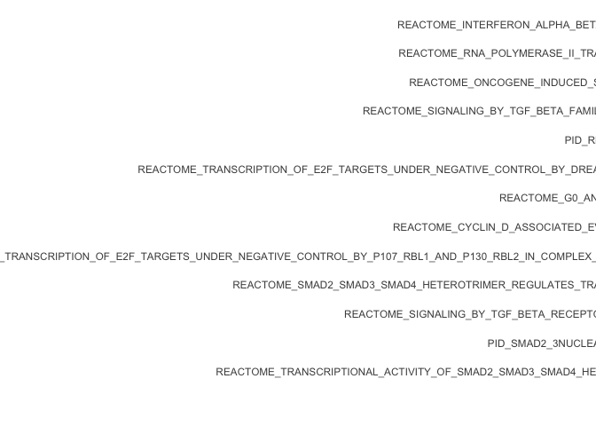
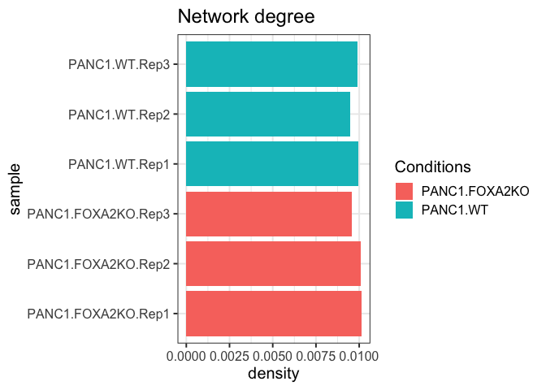
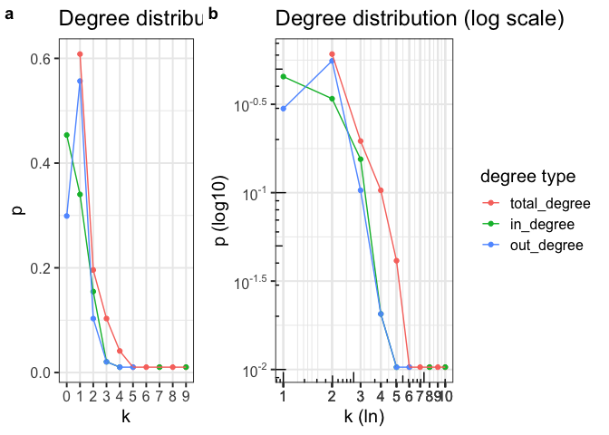
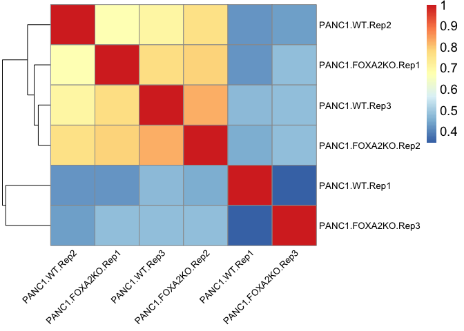
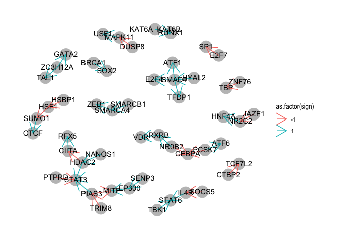

06\_analysis\_CARNIVAL\_results
================
Rosa Hernansaiz-Ballesteros
14/08/2020

### License Info

This program is free software: you can redistribute it and/or modify it
under the terms of the GNU General Public License as published by the
Free Software Foundation, either version 3 of the License, or (at your
option) any later version.

This program is distributed in the hope that it will be useful, but
WITHOUT ANY WARRANTY; without even the implied warranty of
MERCHANTABILITY or FITNESS FOR A PARTICULAR PURPOSE. See the GNU General
Public License for more details.

Please check <http://www.gnu.org/licenses/>.

## Introduction

This is the final part of our series of transcriptomics tutorials. In
previous parts, we normalised RNASeq data for differential analysis, and
used the differential analysis results in **PROGENy** and **DOROTHea**.
In the previous tutorial, we demonstrated **CARNIVAL** with TF
activities from **DOROTHea**, a prior knowledge network from
**Omnipath**, and weights from **PROGENy**.

## CARNIVAL output

CARNIVAL (CAusal Reasoning for Network identification using Integer
VALue programming) returns a list with 4 elements:

  - weightedSIF. Character matrix. Contains a summary of *sifAll*, where
    *Weight* indicates the number of networks that present that
    interaction.

  - nodesAttributes. Character matrix. Contains a summary of
    *attributesAll*, where all columns ending in *Act* indicate the
    number of networks that present that node in each of the states
    (Zero = doesn’t appear in the network, Up = upregulated, Down =
    downregulated, Avg = average regulation). The column *NodeType*
    indicates if the node is a TF’s (T) or a perturbed one (S).

  - sifAll. List of character matrices. All networks that have been
    calculated.

  - attributesAll. List of character matrices.

NOTE: This is valid for current CARNIVAL version (1.0.0)

## CARNIVAL interpretation

The summary files ( *sifAll* and *attributesAll* ) can be directly used
to identify causal interactions between the perturbed nodes and the
selected Transcription Factors. In addition to extracting direct
information from the network, we can run different downstream analysis
based on the necessities of each project.

Here are described some of the downstream approaches that we have used:

  - Pathway enrichment analysis
  - Network comparisons

# Get ready

``` r
library(readr)
library(piano)
library(dplyr)
library(ggplot2)
library(tibble)
library(tidyr)
library(dplyr)
library(scales)
library(plyr)
library(GSEABase)
library(network)
library(reshape2)
library(cowplot)
library(pheatmap)
library(ggraph)
library(tidygraph)

# set working directory
setwd("~/Projects/transcriptutorial/scripts")

## We also load the support functions
source("support_enrichment.r")
source("support_networks.r")

## and the data

#read CARNIVAL results
carnival_result = readRDS("../results/carnival_result.rds")
carnival_sample_resolution = readRDS("../results/carnival_sample_resolution.rds")
pkn = read_tsv("../results/omnipath_carnival.tsv")
```

# Enrichment Analysis

We define two different gene sets in order to conduct the enrichment
analysis. The first set contains the nodes that appear in the CARNIVAL
output, and are therefore relevant in the context of our input
transcriptomic data. The second set contains all the genes in our prior
knowledge network which are used as the background.

We also downloaded from **MSigDB <https://www.gsea-msigdb.org/> the
following dataset: c2.cp.v7.1.symbols.gmt**. It contains several
pathways from different resources and the genes that are known to be
involved in those pathways.

Using the *Piano* R package, we run a gene set analysis (GSA) based on a
list of significant genes (CARNIVAL nodes) and a gene set collection
(background). It uses Fisher’s exact test.

``` r
# Load pathways
pathways = gmt_to_csv("../c2.cp.v7.1.symbols.gmt")

# Extract nodes and background
nodes_carnival = extractCARNIVALnodes(carnival_result)

# Run GSA hyper Geometric test
sig_pathways <- runGSAhyper(genes = nodes_carnival$sucesses, 
    universe = nodes_carnival$bg, gsc = loadGSC(pathways))
sig_pathways_df <- as.data.frame(sig_pathways$resTab)  %>% 
  tibble::rownames_to_column(var = "pathway") 

#data for plotting
PathwaysSelect <- sig_pathways_df %>%
    dplyr::select(pathway, `p-value`, `Adjusted p-value`) %>%
    dplyr::filter(`Adjusted p-value` <= 0.001) %>%
    dplyr::rename(pvalue = `p-value`, AdjPvalu = `Adjusted p-value`) %>% 
    dplyr::mutate(pathway = as.factor(pathway))

PathwaysSelect <- data.frame(t(apply(PathwaysSelect, 1, function(r){
  aux = unlist(strsplit( sub("_",";", r["pathway"]), ";" ))
  r["pathway"] = gsub("_", " ", aux[2])
  return(c(r, "source" = aux[1]))
})))

colnames(PathwaysSelect) = c("pathway", "pvalue", "AdjPvalu", "source")
PathwaysSelect$AdjPvalu = as.numeric(PathwaysSelect$AdjPvalu)

ggdata = PathwaysSelect %>% 
    dplyr::filter(AdjPvalu <= 0.05) %>% 
    dplyr::group_by(source) %>% 
    dplyr::arrange(AdjPvalu) %>%
    dplyr::slice(1:5)

  
# Visualize top results
ggplot(ggdata, aes(y = reorder(pathway, AdjPvalu), x = -log10(AdjPvalu)), color = source) + 
        geom_bar(stat = "identity") +
        facet_grid(source ~ ., scales="free_y") +
        scale_x_continuous(
                         expand = c(0.01, 0.01),
                         limits = c(0, ceiling(max(-log10(PathwaysSelect$AdjPvalu)))),
                         breaks = seq(floor(min(-log10(PathwaysSelect$AdjPvalu))), ceiling(max(-log10(PathwaysSelect$AdjPvalu))), 1),
                         labels = math_format(10^-.x)
                         ) +
        annotation_logticks(sides = "bt") +
        theme_bw() +
        theme(axis.title = element_text(face = "bold", size = 12),
              axis.text.y = element_text(size = 6)) +
        ylab("")
```

<!-- -->

# Topological measurments

We can get a sense of the size of the reconstructed networks using
topological parameters, such as number of edges and nodes. We can also
have a look at the network’s density and the *degree distribution*. The
*density* indicates the proportion of interactions that exist in our
network when comparing with all possible interactions that can be
established. The *degree distribution* shows the number of connections
of a node. In a directed network, we can distinguish between incoming
and outgoing connections.

NOTE: Here the density is calculated for a *directed graph*. As CARNIVAL
can report 2 interactions between the same 2 nodes with different sign,
these “doubled” interactions are excluded when calculating the density.

For this section, and the following ones, we use the CARNIVAL networks
obtained when running the *sample\_resolution\_carnival.R*.

To find out more about this topic:

  - <https://mathinsight.org/degree_distribution>
  - <https://www.networksciencebook.com/chapter/2#degree>

<!-- end list -->

``` r
# get only summary files from CARNIVAL results
sifts = lapply(carnival_sample_resolution, function(x){x$weightedSIF})
nodos = lapply(carnival_sample_resolution, function(x){x$nodesAttributes})

# Calculate the number of edges and nodes in the networks and its density
node_edge = do.call(rbind,lapply(sifts, count_edges_nodes_degree))

# Calculate degree distribution for a sample
count_degree = sifts$PANC1.FOXA2KO.Rep3 %>% degree_count

#degree distribution
p = data.frame(table(count_degree$total_count) / nrow(count_degree))
colnames(p) = c("Var1", "total_degree")
p = merge.data.frame(p, data.frame(table(count_degree$in_count) / nrow(count_degree)), all = T)
colnames(p) = c("Var1", "total_degree", "in_degree")
p = merge.data.frame(p, data.frame(table(count_degree$out_count) / nrow(count_degree)), all = T)
colnames(p) = c("k", "total_degree", "in_degree", "out_degree")
p = melt(p, value.name = "p", id.vars = "k")
p$k = relevel(p$k, "0")

#visualise
ggdat = as.data.frame(node_edge) %>% tibble::rownames_to_column(var = "sample") %>%
  dplyr::mutate(condition = gsub(".Rep[0-9]{1}", "", sample))

#Plotting

# relation between number of edges and nodes
ggplot(ggdat, aes(x = nodes, y = edges, color = as.factor(condition))) +
  geom_point() +
  geom_text(label = ggdat$sample, 
            check_overlap = TRUE,
            vjust = 0, 
            nudge_y = 0.5,
            show.legend = F) +
  theme_bw(base_size = 15) +
  guides(color = guide_legend( title="Conditions" ) ) +
  ggtitle("Node-edge composition")
```

<!-- -->

``` r
#network degree
ggplot(ggdat, aes(x = density, y = sample, fill = as.factor(condition) )) +
  geom_col() +
  theme_bw(base_size = 15) +
  guides(fill = guide_legend( title="Conditions" ) ) +
  ggtitle("Network degree")
```

<!-- -->

``` r
# degree distribution

dd <- ggplot(data = p, aes(x = k, y = p, group = variable, color = variable)) +
  geom_point() +
  geom_line() +
  theme_bw(base_size = 15) +
  theme(legend.position="none") +
  guides(color = guide_legend( title = "degree type" ) ) +
  ggtitle("Degree distribution")

ddp <- ggplot(data = p, aes(x = as.numeric(k), y = p, group = variable, color = variable)) +
  geom_point() +
  geom_line() +
  scale_x_continuous(breaks = as.numeric(p$k), 
                     trans = scales::log_trans()) +
  scale_y_log10(breaks = trans_breaks("log10", function(x) 10^x),
              labels = trans_format("log10", math_format(10^.x))) +
  annotation_logticks() +
  theme_bw(base_size = 15) +
  guides(color = guide_legend( title = "degree type" ) ) +
  ggtitle("Degree distribution (log scale)") +
  xlab("k (ln)") + ylab("p (log10)")

plot_grid(dd, ddp, labels = "auto", rel_widths = c(1, 2))
```

<!-- -->

Generally speaking, biological networks are not dense, so don’t worry if
the density values are low… they usually are\!

The degree distribution is an interesting graphic to look at, as we can
get some immediate information:

  - k = 0 for in-degree indicates the proportion of initial nodes, while
    for out-degree indicates the effectors (here the TFs). For
    total-degree, that would indicate the presence of isolated nodes.

  - Most of the nodes do not have many connections (e.g. k = 1 -\> p =
    0.6), but there are a few that are highly connected (e.g. k \> 6).

  - We can find some hubs when k is higher (plot B). The out-degree ends
    at k = 5; this means that the biggest regulatory-hub regulates at
    most 5 other nodes. In a similar way, the in-degree goes up to k =
    9; This means that there are few hubs (k \> 5) that are regulated by
    at most 9 nodes.

# Network comparison

When we have more than one network, we usually would like to know how
(dis)similar these networks are.

We can use the *Jaccard Index* to measure similarities and diversity
between sample sets (<https://en.wikipedia.org/wiki/Jaccard_index>).
This index can be used in different scenarios. Generally, it’s used with
the nodes, but we can also use it with the edges.

When we have groups, in our case WT and FOXA2KO, we can also extract the
interactions that are common.

``` r
# create a matrix of all interactions for all samples

interactions = getTopology(networks = sifts, scafoldNET = pkn)

# get the edges per sample
net_int = apply(interactions, 2, function(x, r){
  r[which(!is.na(x))]
}, rownames(interactions))

# calculate Jaccard indexes per pair
combined = expand.grid(1:length(names(sifts)), 1:length(names(sifts)))
jac_index = matrix(data = NA, nrow = length(names(sifts)), ncol = length(names(sifts)),
                   dimnames = list(names(sifts), names(sifts)))

for (i in 1:nrow(combined)){
  n = names(sifts)[combined[i,1]]
  m = names(sifts)[combined[i,2]]
  jac_index[n,m] = length( intersect(net_int[[n]], net_int[[m]]) ) / length( union(net_int[[n]], net_int[[m]]) )
}

# Visualize the indexes in a heatmap

pheatmap::pheatmap(jac_index,fontsize=14, 
           fontsize_row = 10, fontsize_col = 10, 
           angle_col = 45, treeheight_col = 0)
```

<!-- -->

``` r
# Get common interactions in a group

shared_interactions_WT = getCoreInteractions(topology = interactions[,1:3], psmpl = 100)

# Visualise the interactions
colnames(shared_interactions_WT) = c("from", "sign", "to")
labels_edge = c("-1" = "inhibition", "1" = "activation")
nodes = data.frame(union(shared_interactions_WT$from, shared_interactions_WT$to))
colnames(nodes) = "nodes"
nodes$label = nodes$nodes

tidygraph::tbl_graph(nodes = nodes, edges = shared_interactions_WT) %>%
    ggraph::ggraph(layout = "nicely") + 
    geom_node_point(color = "#C0C0C0", size = 8) +
    geom_edge_link(arrow = arrow(), aes(edge_colour=as.factor(sign))) +
    theme_graph() +
   geom_node_text(aes(label = label), vjust = 0.4)
```

<!-- -->

## Session Info Details

    ## R version 4.0.2 (2020-06-22)
    ## Platform: x86_64-apple-darwin17.0 (64-bit)
    ## Running under: macOS  10.16
    ## 
    ## Matrix products: default
    ## BLAS:   /Library/Frameworks/R.framework/Versions/4.0/Resources/lib/libRblas.dylib
    ## LAPACK: /Library/Frameworks/R.framework/Versions/4.0/Resources/lib/libRlapack.dylib
    ## 
    ## locale:
    ## [1] en_US.UTF-8/en_US.UTF-8/en_US.UTF-8/C/en_US.UTF-8/en_US.UTF-8
    ## 
    ## attached base packages:
    ## [1] stats4    parallel  stats     graphics  grDevices utils     datasets 
    ## [8] methods   base     
    ## 
    ## other attached packages:
    ##  [1] snowfall_1.84-6.1    snow_0.4-3           tidygraph_1.2.0     
    ##  [4] ggraph_2.0.3         pheatmap_1.0.12      cowplot_1.0.0       
    ##  [7] reshape2_1.4.4       network_1.16.0       GSEABase_1.50.1     
    ## [10] graph_1.66.0         annotate_1.66.0      XML_3.99-0.5        
    ## [13] AnnotationDbi_1.50.3 IRanges_2.22.2       S4Vectors_0.26.1    
    ## [16] Biobase_2.48.0       BiocGenerics_0.34.0  plyr_1.8.6          
    ## [19] scales_1.1.1         tidyr_1.1.1          tibble_3.0.3        
    ## [22] ggplot2_3.3.2        dplyr_1.0.2          piano_2.4.0         
    ## [25] readr_1.3.1         
    ## 
    ## loaded via a namespace (and not attached):
    ##  [1] bitops_1.0-6         bit64_4.0.2          RColorBrewer_1.1-2  
    ##  [4] tools_4.0.2          R6_2.4.1             DT_0.15             
    ##  [7] KernSmooth_2.23-17   DBI_1.1.0            colorspace_1.4-1    
    ## [10] withr_2.2.0          tidyselect_1.1.0     gridExtra_2.3       
    ## [13] bit_4.0.4            compiler_4.0.2       shinyjs_1.1         
    ## [16] labeling_0.3         slam_0.1-47          caTools_1.18.0      
    ## [19] relations_0.6-9      stringr_1.4.0        digest_0.6.25       
    ## [22] rmarkdown_2.3        pkgconfig_2.0.3      htmltools_0.5.0     
    ## [25] fastmap_1.0.1        limma_3.44.3         htmlwidgets_1.5.1   
    ## [28] rlang_0.4.7          RSQLite_2.2.0        shiny_1.5.0         
    ## [31] farver_2.0.3         visNetwork_2.0.9     generics_0.0.2      
    ## [34] jsonlite_1.7.0       BiocParallel_1.22.0  gtools_3.8.2        
    ## [37] RCurl_1.98-1.2       magrittr_1.5         Matrix_1.2-18       
    ## [40] Rcpp_1.0.5           munsell_0.5.0        viridis_0.5.1       
    ## [43] lifecycle_0.2.0      stringi_1.4.6        yaml_2.2.1          
    ## [46] MASS_7.3-51.6        gplots_3.0.4         grid_4.0.2          
    ## [49] blob_1.2.1           ggrepel_0.8.2        gdata_2.18.0        
    ## [52] promises_1.1.1       shinydashboard_0.7.1 crayon_1.3.4        
    ## [55] lattice_0.20-41      graphlayouts_0.7.0   hms_0.5.3           
    ## [58] knitr_1.29           pillar_1.4.6         fgsea_1.14.0        
    ## [61] igraph_1.2.5         marray_1.66.0        fastmatch_1.1-0     
    ## [64] glue_1.4.1           evaluate_0.14        data.table_1.13.0   
    ## [67] tweenr_1.0.1         vctrs_0.3.2          httpuv_1.5.4        
    ## [70] polyclip_1.10-0      gtable_0.3.0         purrr_0.3.4         
    ## [73] ggforce_0.3.2        xfun_0.16            mime_0.9            
    ## [76] xtable_1.8-4         later_1.1.0.1        viridisLite_0.3.0   
    ## [79] memoise_1.1.0        sets_1.0-18          cluster_2.1.0       
    ## [82] ellipsis_0.3.1
